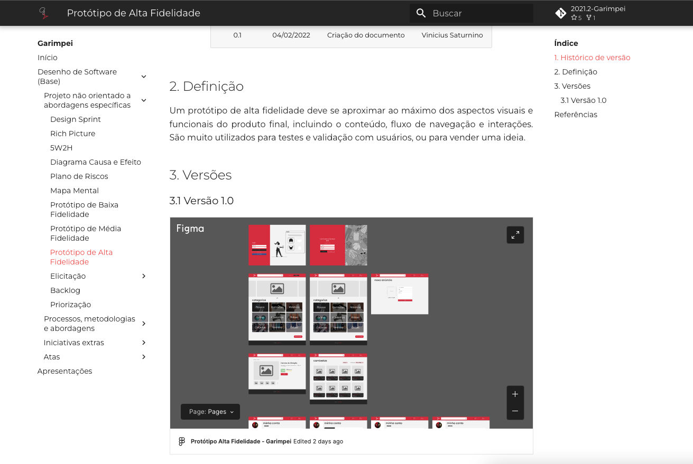
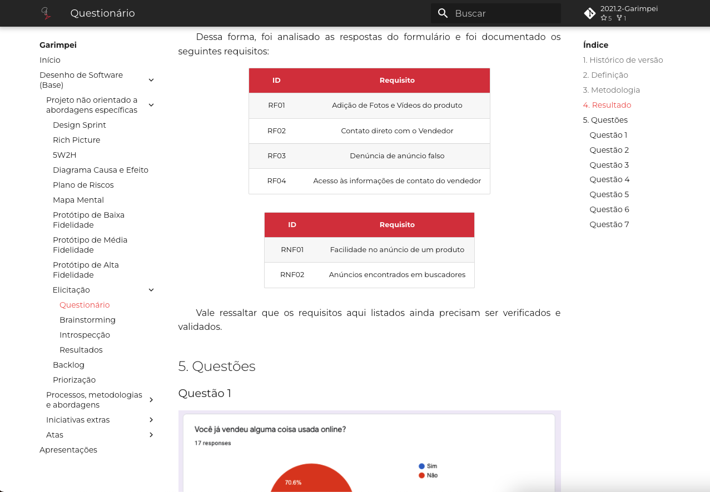
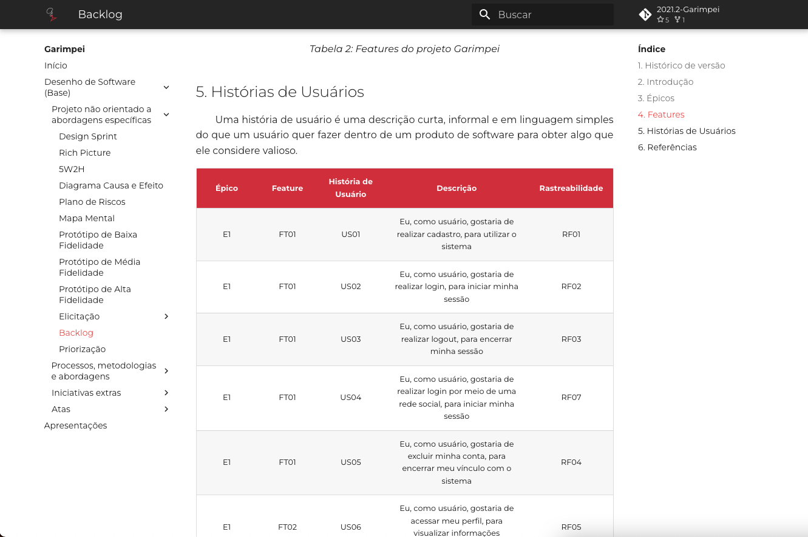
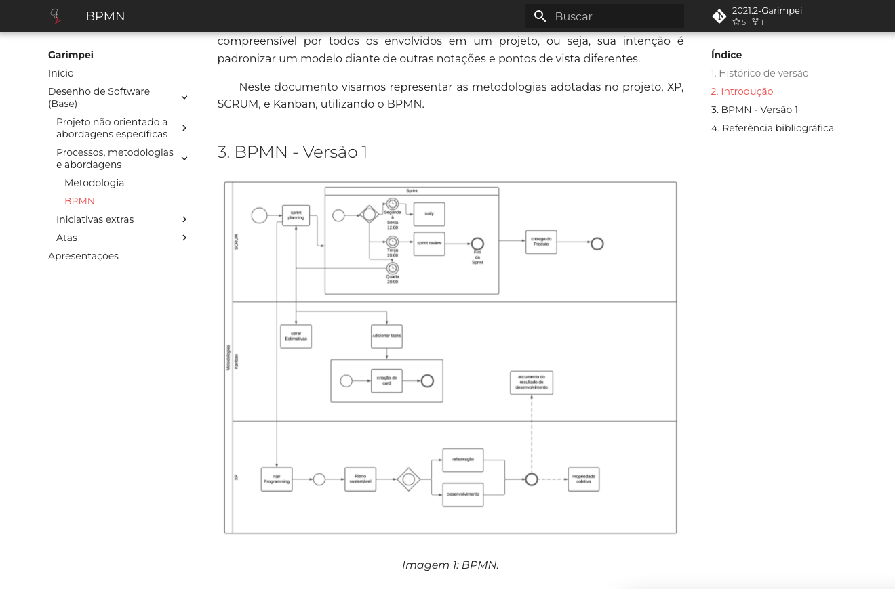
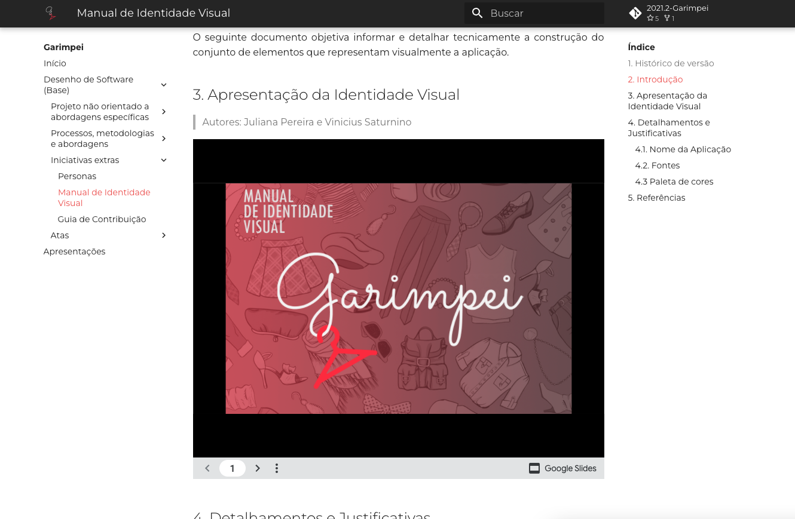

# Garimpei

**Código da Disciplina**: FGA0208 
**Número do Grupo**: 5 

## Alunos

| Matrícula  | Aluno                                   |
| ---------- | --------------------------------------- |
| 18/0127641 | Matheus Afonso de Souza                 |
| 18/0129058 | Paulo Victor da Silva                   |
| 18/0132245 | Vinicius de Sousa Saturnino             |
| 18/0138545 | Thiago Mesquita Peres Nunes de Carvalho |
| 18/0124099 | Juliana Pereira Valle Gonçalves         |
| 17/0101711 | Daniel Barcelos Moreira                 |
| 18/0106821 | Mateus Gomes do Nascimento              |
| 18/0041592 | Denys Rógeres Leles dos Santos          |
| 18/0055241 | Victor Jorge da Silva Gonçalves         |

## Sobre

Imagine uma comunidade que resolve abrir um bazar/brechó, com artigos que são doados ou mesmo confeccionados por membros da comunidade. Esses artigos acabam sendo vendidos para os próprios locais. Por que não pensar em um aplicativo ou aplicação web, e ampliar as estratégias de venda dessa iniciativa da comunidade? Estando na internet, pessoas até mesmo de outras localidades poderiam se interessar pelos artigos...

## Screenshots Primeira Entrega <<FOCO: DSW(Base)>>

Adicione 2 ou mais screenshots do projeto em termos de artefatos da Primeira Entrega. OBS: Profa. Milene: PRAZO NÃO ATENDIDO - NÃO ESTÁ NA WIKI TAMBÉM

## Vídeo(s) Primeira Entrega <<FOCO: DSW(Base)>>

Adicione o(s)s vídeo(s) da Primeira Entrega. OBS: Profa. Milene: PRAZO NÃO ATENDIDO - NÃO ESTÁ NA WIKI TAMBÉM

### Projeto não orientado a abordagens específicas

<iframe width="854" height="480" src="https://www.youtube.com/embed/tbOJ7NEPopo" title="YouTube video player" frameborder="0" allow="accelerometer; autoplay; clipboard-write; encrypted-media; gyroscope; picture-in-picture" allowfullscreen></iframe>

### Processos, metodologias e abordagens

<iframe width="854" height="480" src="https://www.youtube.com/embed/dwFRFR4AvN0" title="YouTube video player" frameborder="0" allow="accelerometer; autoplay; clipboard-write; encrypted-media; gyroscope; picture-in-picture" allowfullscreen></iframe>

### Iniciativas extras

<iframe width="854" height="480" src="https://www.youtube.com/embed/bUKAadIg2PY" title="YouTube video player" frameborder="0" allow="accelerometer; autoplay; clipboard-write; encrypted-media; gyroscope; picture-in-picture" allowfullscreen></iframe>

## Screenshots Segunda Entrega <<FOCO: DSW(Modelagem)>>

Adicione 2 ou mais screenshots do projeto em termos de artefatos da Segunda Entrega.

## Vídeo(s) Segunda Entrega <<FOCO: DSW(Modelagem)>>

Adicione o(s)s vídeo(s) da Segunda Entrega.

## Screenshots Terceira Entrega <<FOCO: DSW(Padrões de Projeto)>>

Adicione 2 ou mais screenshots do projeto em termos de artefatos da Terceira Entrega.

## Vídeo(s) Terceira Entrega <<FOCO: DSW(Padrões de Projeto)>>

Adicione o(s)s vídeo(s) da Terceira Entrega.

## Screenshots Quarta Entrega (FINAL) <<FOCOS: Arquitetura & Reutilização de Software & PROJETO FINAL>>

Adicione 2 ou mais screenshots do projeto em termos de interface e/ou funcionamento.

## Vídeo(s) Quarta Entrega (FINAL) <<FOCOS: Arquitetura & Reutilização de Software & PROJETO FINAL>>

Adicione o(s)s vídeo(s) da Entrega Final.

## Descritivo dos Principais Aspectos Técnicos

**Principal(is) Metodologia(s) Adotada(s)**: xxxxxx 
**Principais Linguagens Utilizadas e/ou Pretendidas**: xxxxxx 
**Principais Tecnologias Utilizadas e/ou Pretendidas**: xxxxxx 
**Principal(is) Estilo(s) Arquitetural(is) Adotado(s)**: xxxxxx 

## O Projeto está rodando?

( ) SIM
( ) NÃO
Se SIM, insira um manual (ou um script) para auxiliar ainda mais os interessados em consultar o projeto.

## Informações Complementares

Quaisquer outras informações sobre seu projeto podem ser descritas nessa seção.
