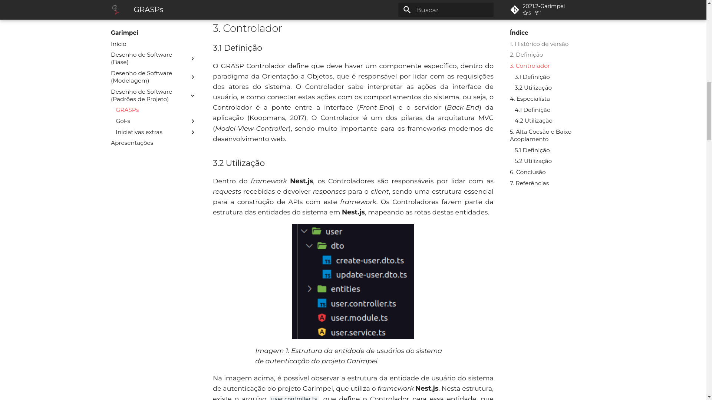
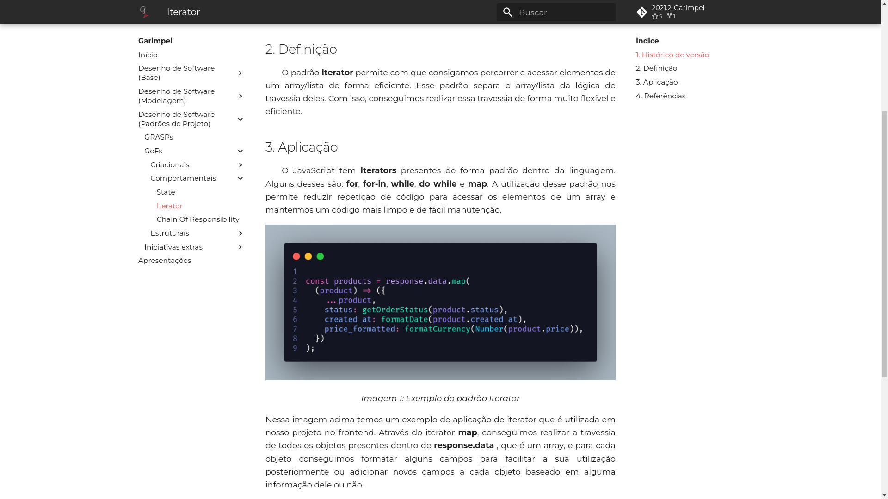
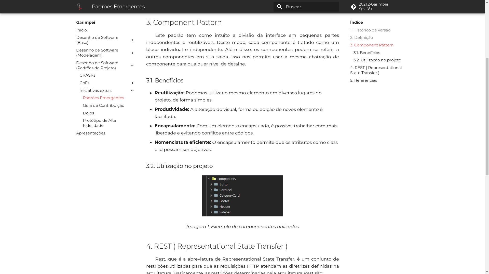
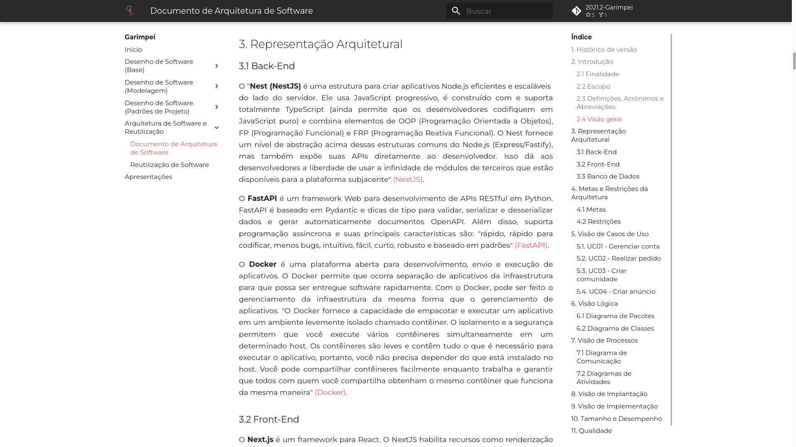
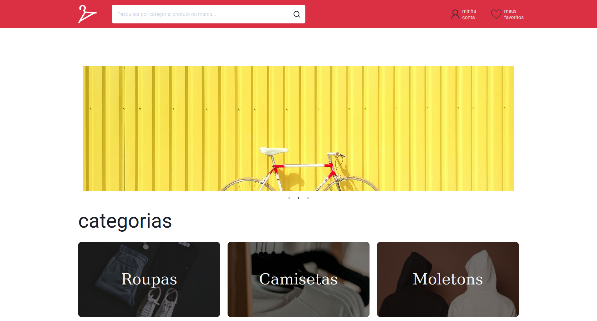
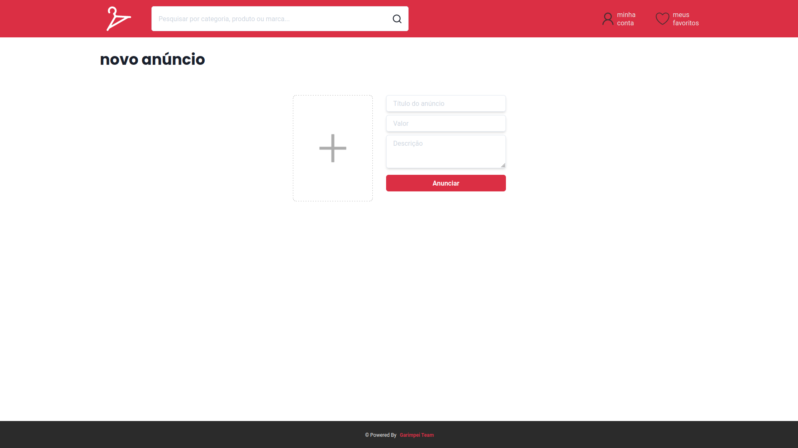
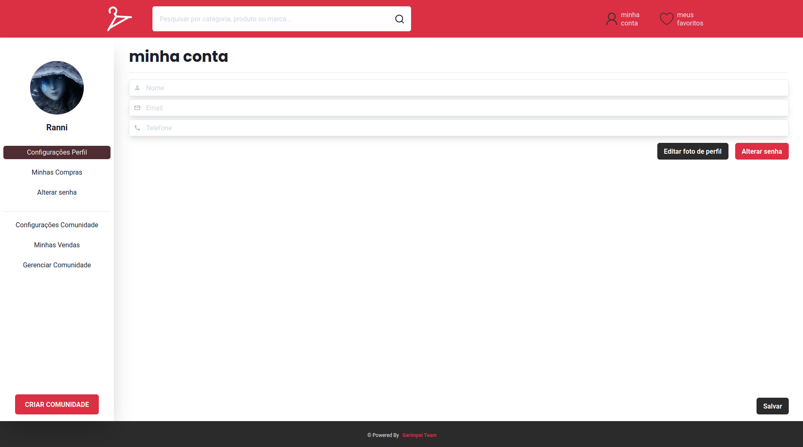

# Garimpei

**Código da Disciplina**: FGA0208<br>
**Número do Grupo**: 5<br>

## Alunos

| Matrícula  | Aluno                                   |
| ---------- | --------------------------------------- |
| 18/0127641 | Matheus Afonso de Souza                 |
| 18/0129058 | Paulo Victor da Silva                   |
| 18/0132245 | Vinicius de Sousa Saturnino             |
| 18/0138545 | Thiago Mesquita Peres Nunes de Carvalho |
| 18/0124099 | Juliana Pereira Valle Gonçalves         |
| 17/0101711 | Daniel Barcelos Moreira                 |
| 18/0106821 | Mateus Gomes do Nascimento              |
| 18/0041592 | Denys Rógeres Leles dos Santos          |
| 18/0055241 | Victor Jorge da Silva Gonçalves         |

## Sobre

Imagine uma comunidade que resolve abrir um bazar/brechó, com artigos que são doados ou mesmo confeccionados por membros da comunidade. Esses artigos acabam sendo vendidos para os próprios locais. Por que não pensar em um aplicativo ou aplicação web, e ampliar as estratégias de venda dessa iniciativa da comunidade? Estando na internet, pessoas até mesmo de outras localidades poderiam se interessar pelos artigos...

## Screenshots Primeira Entrega <<FOCO: DSW(Base)>>

Adicione 2 ou mais screenshots do projeto em termos de artefatos da Primeira Entrega. OBS: Profa. Milene: PRAZO NÃO ATENDIDO - NÃO ESTÁ NA WIKI TAMBÉM


---


## Vídeo(s) Primeira Entrega <<FOCO: DSW(Base)>>

Adicione o(s)s vídeo(s) da Primeira Entrega. OBS: Profa. Milene: PRAZO NÃO ATENDIDO - NÃO ESTÁ NA WIKI TAMBÉM

### Projeto não orientado a abordagens específicas

<center>

[](https://www.youtube.com/watch?v=tbOJ7NEPopo)
<br />
[Link do vídeo](https://www.youtube.com/watch?v=tbOJ7NEPopo)

</center>

### Processos, metodologias e abordagens

<center>

[](https://www.youtube.com/watch?v=dwFRFR4AvN0)
<br />
[Link do vídeo](https://www.youtube.com/watch?v=dwFRFR4AvN0)
  
</center>

### Iniciativas extras

<center>

[](https://www.youtube.com/watch?v=bUKAadIg2PY)
<br />
[Link do vídeo](https://www.youtube.com/watch?v=bUKAadIg2PY)
  
</center>

## Screenshots Segunda Entrega <<FOCO: DSW(Modelagem)>>


## Vídeo(s) Segunda Entrega <<FOCO: DSW(Modelagem)>>

Adicione o(s)s vídeo(s) da Segunda Entrega.

### Diagramas Estáticos

<center>

[](https://www.youtube.com/watch?v=TlHD5W1ev9A)
<br />
[Link do vídeo](https://www.youtube.com/watch?v=TlHD5W1ev9A)

</center>

### Diagramas Dinâmicos

<center>

[](https://www.youtube.com/watch?v=oUVrIeFsodk0)
<br />
[Link do vídeo](https://www.youtube.com/watch?v=oUVrIeFsodk0)
  
</center>

### Modelagem Ágil

<center>

[](https://www.youtube.com/watch?v=OK1MPPcTIhY)
<br />
[Link do vídeo](https://www.youtube.com/watch?v=OK1MPPcTIhY)
  
</center>

### Iniciativas extras

<center>

[](https://www.youtube.com/watch?v=65TqEnFsJbw)
<br />
[Link do vídeo](https://www.youtube.com/watch?v=65TqEnFsJbw)
  
</center>

## Screenshots Terceira Entrega <<FOCO: DSW(Padrões de Projeto)>>





## Vídeo(s) Terceira Entrega <<FOCO: DSW(Padrões de Projeto)>>

### GRASPs

<center>

[](https://www.youtube.com/watch?v=B3OCGmqmPqE)
<br />
[Link do vídeo](https://www.youtube.com/watch?v=B3OCGmqmPqE)

</center>

### GOFs

<center>

[](https://www.youtube.com/watch?v=sTIVPrkttlM)
<br />
[Link do vídeo](https://www.youtube.com/watch?v=sTIVPrkttlM)

</center>

### Padrões Emergentes

<center>

[](https://www.youtube.com/watch?v=Tlz20rllSvY)
<br />
[Link do vídeo](https://www.youtube.com/watch?v=Tlz20rllSvY)

</center>

## Screenshots Quarta Entrega (FINAL) <<FOCOS: Arquitetura & Reutilização de Software & PROJETO FINAL>>







## Vídeo(s) Quarta Entrega (FINAL) <<FOCOS: Arquitetura & Reutilização de Software & PROJETO FINAL>>

### Documento de Arquitetura de Software

<center>

[](https://www.youtube.com/watch?v=LXrETEvrEts)
<br />
[Link do vídeo](https://www.youtube.com/watch?v=LXrETEvrEts)

</center>

### Reutilização de Software

<center>

[](https://www.youtube.com/watch?v=XQqpwKlctHM)
<br />
[Link do vídeo](https://www.youtube.com/watch?v=XQqpwKlctHM)

</center>

## Descritivo dos Principais Aspectos Técnicos

**Principal(is) Metodologia(s) Adotada(s)**: Scrum, Kanban e XP<br>
**Principais Linguagens Utilizadas e/ou Pretendidas**: Python, Javascript e Typescript<br>
**Principais Tecnologias Utilizadas e/ou Pretendidas**: NextJS, NestJS, FastAPI, PostgreSQL, Docker e ChakraUI<br>
**Principal(is) Estilo(s) Arquitetural(is) Adotado(s)**: GRASP's controlador, especialista, alta coesão e baixo acoplamento. GoF's singleton, state, iterator, chain of responsability, decorator, composite, facade. Microserviços, Single-page application e Gateway<br>

## O Projeto está rodando?

(X) SIM
( ) NÃO

---

## 🔧 Pré-requisitos

- NodeJS
- Recomendado: Yarn

---

## 🌟 Como usar o projeto

```sh

  # Clone o repositório
  $ git clone https://github.com/UnBArqDsw2021-2/2021.2_G5_Garimpei_Frontend.git

  # Acessar pasta do repositório
  $ cd 2021.2_G5_Garimpei_Frontend

  # Instalar as dependências
  $ npm install ou yarn

  # Iniciar a aplicação
  $ npm dev ou yarn dev

```

---
