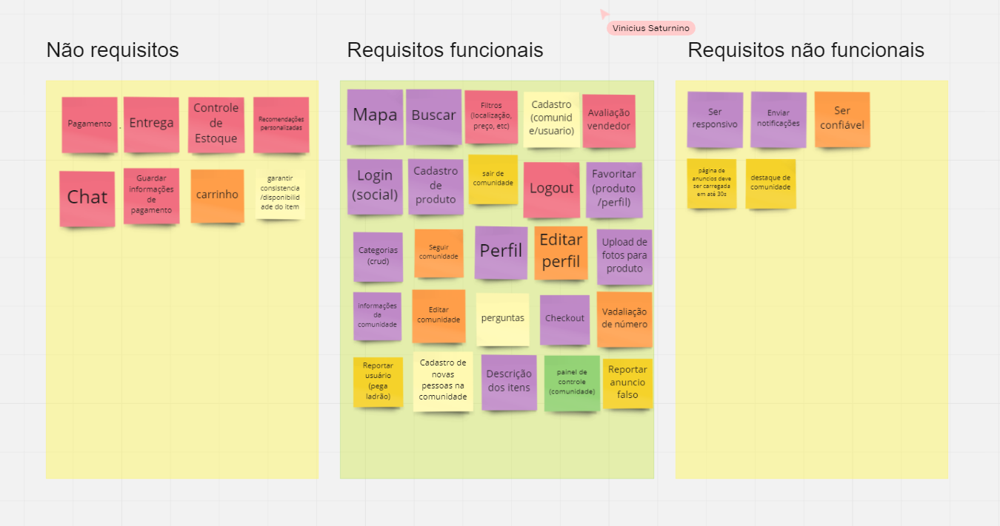

# Brainstorming

## 1. Histórico de versão

| Versão | Data       | Descrição                                           | Autor        |
| ------ | ---------- | --------------------------------------------------- | ------------ |
| 0.1    | 02/02/2022 | Criação da documentação relacionada ao brainstorming | Matheus Afonso |
| 0.2    | 02/02/2022 | Centralização das tabelas | Matheus Afonso |
| 0.3    | 04/02/2022 | Revisão do documento | Juliana Valle |

## 2. Definição

&emsp;&emsp;A técnica de elicitação através do brainstorming é baseada em uma reunião, com um espaço de tempo pré-definido, entre os engenheiros de requisitos, com o objetivo de explorar ideias, interagir com os outros participantes e compartilhar suas opiniões. Assim, listando a maior quantidade de requisitos possível, visando entender o que os usuários querem e precisam. Normalmente esta técnica é utilizada no inicío do processo de elicitação, quando pouco do produto, do processo e do projeto é conhecido.

## 3. Metodologia

&emsp;&emsp;Devido a pandemia não foi possível que os integrantes se reunissem pessoalmente para a execução do brainstorming, como seria o ideal. Para conseguirmos realizar a técnica, nos reunimos através do discord para podermos nos comunicarmos, e utilizamos a ferramenta miro, para poder expor e organizar as nossas ideias, com o objetivo de explorar a fundo os pensamentos e ideias de cada participante.

&emsp;&emsp;Através da plataforma Miro, os integrantes do grupo puderam levantar os requisitos para a aplicação e dividir eles entre requisitos não funcionais e requisitos funcionais, assim, facilitando na visibilidade deles e execução do processo de elicitação por brainstorming.

<figcaption>Imagem 1: Board brainstorming Miro.</figcaption>

## 4. Resultado

&emsp;&emsp;A partir dos dados obtidos pelo brainstorming foi possível levantar possíveis requisitos da aplicação.

&emsp;&emsp;Dessa forma, foram detectados os seguintes requisitos:

|  ID  |                  Requisito                   |
| :--: | :------------------------------------------: |
| RF01 | Possuir um mapa com localização do produto |
| RF02 | Possuir uma barra para buscas |
| RF03 | Ser capapz de buscar baseado em filtros |
| RF04 | Ser capapz de cadastrar uma comunidade |
| RF05 | Ser capapz de cadastrar um usuário |
| RF06 | Ser capapz de avaliar um vendedor |
| RF07 | Ser capaz de realizar login através de uma rede social |
| RF08 | Ser capaz de cadastrar um produto |
| RF09 | Ser capaz de sair de uma comunidade |
| RF10 | Ser capaz de realizar logout |
| RF11 | Ser capaz de favoritar um produto |
| RF12 | Ser capaz de favoritar uma comunidade |
| RF13 | Ser capaz de cadastrar categorias |
| RF14 | Ser capaz de acessar o perfil do usuário |
| RF15 | Ser capaz de alterar o perfil do usuário |
| RF15 | Ser capaz de fornecer fotos para o produto anunciado |
| RF16 | Ser capaz de fornecer informações de uma comunidade |
| RF17 | Ser capaz de alterar as informações de uma comunidade |
| RF18 | Ser capaz de fazer perguntas em um anúncio |
| RF19 | Ser capaz de realizar o processo de checkout |
| RF20 | Ser capaz de reportar um usuário |
| RF21 | Ser capaz de cadastrar usuários como membros de uma comunidade |
| RF22 | Ser capaz de fornecer uma descrição para o produto |
| RF23 | Ser capaz de acessar um painel de controle para a comunidade |

|  ID   |              Requisito              |
| :---: | :---------------------------------: |
| RNF01 | O sistema deve ser responsivo |
| RNF02 | O sistema deve ser capaz de enviar notificações |
| RNF03 | O sistema deve ser confiável |
| RNF04 | A página de anúncio deve ser carregada em até 30 segundos |
| RNF05 | O sistema deve ser capaz de destacar comunidades |
| RNF05 | O sistema deve ser capaz de validar o formato de um número de telefone |

&emsp;&emsp;Vale ressaltar que os requisitos aqui listados ainda precisam ser verificados e validados.
