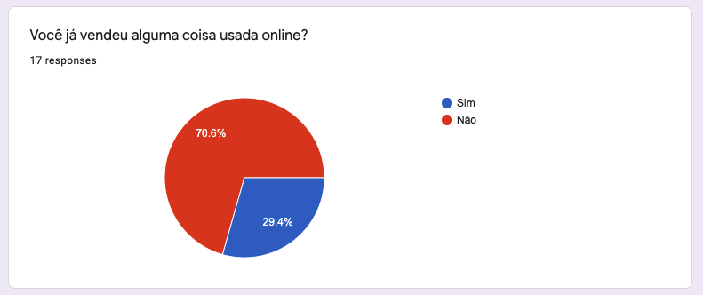
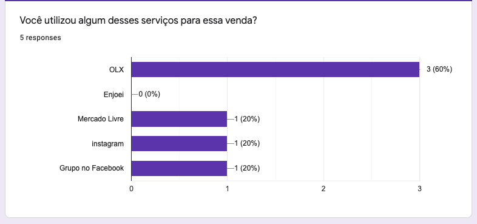
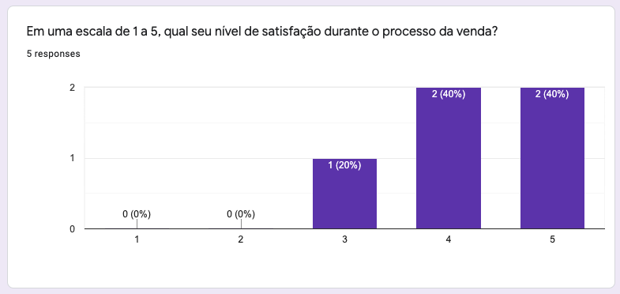
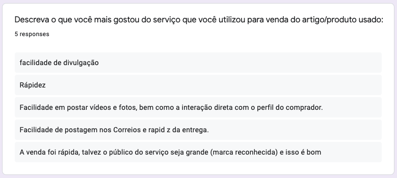
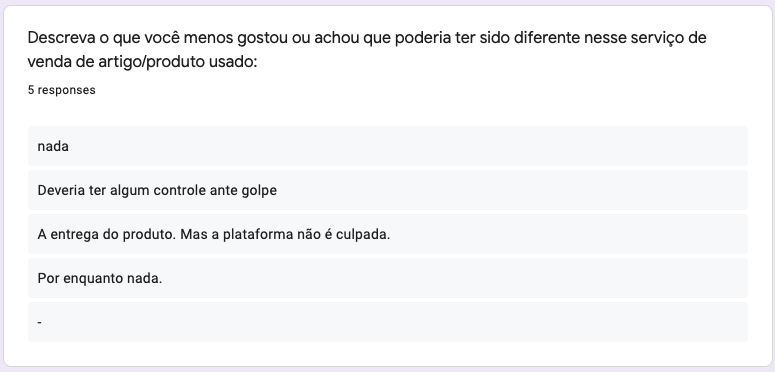
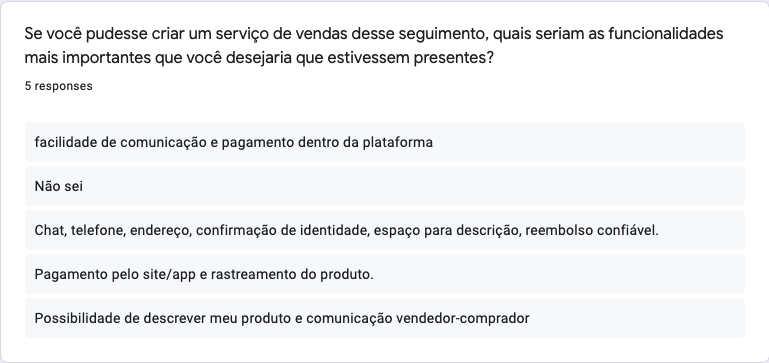
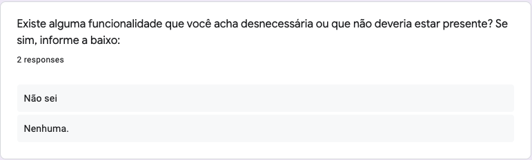

# Questionário

## 1. Histórico de versão

| Versão | Data       | Descrição                                           | Autor        |
| ------ | ---------- | --------------------------------------------------- | ------------ |
| 0.1    | 01/02/2022 | Criação da documentação relacionada ao questionário | Paulo Victor |

## 2. Definição

&emsp;&emsp;A técnica de elicitação através de questionário é baseada em realizar uma pesquisa com um conjunto de pessoas de forma a entender a opinião, visão e demais problemas relacionados a algum tema. No caso do nosso projeto, esse questionário é realizado de forma online, pois não gera custos para a equipe, evita possíveis riscos de saúde devido à pandemia e colabora para que consigamos colher um maior número de dados de pessoas em realidades diferentes.

## 3. Metodologia

&emsp;&emsp;Para conseguirmos analisar os dados com precisão e diminuirmos a quantidade de respostas sem relevância para o projeto, decidimos iniciar com o questionamento sobre se o usuário já teve alguma experiência de venda de itens usados online. Caso o usuário informe que nunca vendeu nada usado online, redirecionamos o mesmo para a finalização do questionário. Caso contrário, seguimos com as perguntas que discernimos trazer a melhor visão sobre a forma como as pessoas costumam vender online.

&emsp;&emsp;Levando em consideração a pouca flexibilidade que essa técnica pode fornecer por ser constituída principalmente de perguntas "fechadas", que não permitem o indivíduo que está respondendo a liberdade de descrever sua resposta, optamos então em adicionar algumas perguntas abertas para conseguir capturar um feedback mais orgânico e não tão limitado.

&emsp;&emsp;Decidimos montar o questionário utilizando a plataforma Google Forms. Após um período de preparação, finalizamos a montagem do questionário com um total de 7 perguntas. Através da divulgação e do compartilhamento dos integrantes da equipe, conseguimos receber um total de 17 respostas.

## 4. Resultado

&emsp;&emsp;A partir dos dados obtidos pelo questionário foi possível analisar o grupo alvo da aplicação e realizar suposições que levam a requisitos do sistema que será desenvolvido.

&emsp;&emsp;Dessa forma, foi analisado as respostas do formulário e foi documentado os seguintes requisitos:

|  ID  |                  Requisito                   |
| :--: | :------------------------------------------: |
| RF01 |     Adição de Fotos e Vídeos do produto      |
| RF02 |        Contato direto com o Vendedor         |
| RF03 |          Denúncia de anúncio falso           |
| RF04 | Acesso às informações de contato do vendedor |

|  ID   |              Requisito              |
| :---: | :---------------------------------: |
| RNF01 | Facilidade no anúncio de um produto |
| RNF02 | Anúncios encontrados em buscadores  |

&emsp;&emsp;Vale ressaltar que os requisitos aqui listados ainda precisam ser verificados e validados.

## 5. Questões

### Questão 1

<figcaption>Imagem 1: Questão 1 do questionário.</figcaption>

&emsp;&emsp;Nosso primeiro passo foi conhecer o público e conseguir filtrar quem estivesse respondendo de forma a evitar que quem nunca vendeu algo usado online respondesse as questões seguintes de forma aleatória prejudicando nossa análise dos resultados.

### Questão 2

<figcaption>Imagem 2: Questão 2 do questionário.</figcaption>

&emsp;&emsp;Com essa questão conseguimos entender de onde surgiu a experiência dos usuários em venda online e permitindo assim que consigamos realizar uma comparação das funcionalidades dessas plataformas em comparação com aquilo que planejamos para o Garimpei.

### Questão 3

<figcaption>Imagem 3: Questão 3 do questionário.</figcaption>

&emsp;&emsp;O objetivo dessa pergunta foi conseguirmos analisar se o formato e a UX dessas plataformas existentes já resolvem o problema do usuário e, permitindo assim, que ao invés de criarmos algo do zero, possamos reutilizar e melhorar com base no que já existe.

### Questão 4

<figcaption>Imagem 4: Questão 4 do questionário.</figcaption>

&emsp;&emsp;Nessa pergunta cada pessoa que participou do questionário pode descrever o que mais agradou durante sua experiência de venda online.

### Questão 5

<figcaption>Imagem 5: Questão 5 do questionário.</figcaption>

&emsp;&emsp;Semelhante a questão anterior, nessa buscamos entender quais foram as dores do usuário durante a venda, permitindo assim que consigamos focar nesses pontos de forma a criar uma solução que agrade mais o usuário.

### Questão 6

<figcaption>Imagem 6: Questão 6 do questionário.</figcaption>

&emsp;&emsp;Com essa questão, cada pessoa que respondeu pode escolher o que seria a melhor funcionalidade, na visão dela, em uma aplicação desse segmento.

### Questão 7

<figcaption>Imagem 7: Questão 7 do questionário.</figcaption>

&emsp;&emsp;O objetivo dessa questão foi tentar descobrir se tinha alguma funcionalidade na qual os usuários não gostavam ou que eles prefeririam que não existisse.
