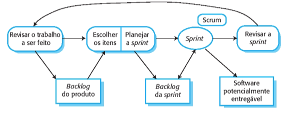
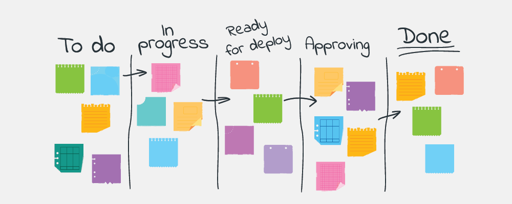
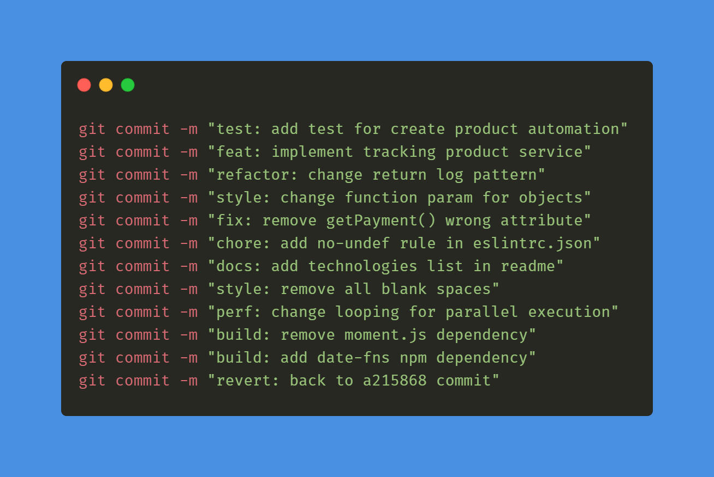

# Metodologia

## 1. Histórico de versão

| Versão | Data       | Descrição                                           | Autor        |
| ------ | ---------- | --------------------------------------------------- | ------------ |
| 0.1    | 02/02/2022 | Criação da documentação relacionada a metodologia utilizada no projeto| Thiago Mesquita |

## 2. Métodos ágeis

&emsp;&emsp;Os métodos ágeis são projetados para produzir software útil rapidamente. Eles são baseados no desenvolvimento incremental. Os incrementos são pequenos e uma nova versão do sistema geralmente é criada e fornecida aos clientes a cada duas ou três semanas, para que seja possível obter um feedback rapidamente sobre as mudanças nos requisitos. Além disso, esses métodos minimizam a documentação usando comunicação informal no lugar de reuniões formais com documentos escritos.

 Os métodos ágeis consideram o design e a implementação como atividades centrais no processo de software. Eles incorporam outras tarefas a essas atividades, como a elicitação dos requisitos e os testes. Apesar de existirem diversos processos ágeis, todos compartilham um conjunto de princípios com base no manifesto ágil e foi descrito por Sommerville, Ian (2019, p. 61):

|  Princípio  |                  Descrição                  |
| :--: | :------------------------------------------: |
| Envolvimento do Cliente |     Os clientes devem ser envolvidos em todo o processo de desenvolvimento. Seu papel é fornecer e priorizar novos requisitos de sistema e avaliar as iterações do sistema.      |
| Acolher as mudanças |        Tenha em mente que os requisitos do sistema mudam e, portanto, deve-se projetar o sistema para acomodar essas mudanças.        |
| Entrega incremental |          O software é desenvolvido em incrementos e o cliente especifica os requisitos incluídos em cada um deles.          |
| Manter a simplicidade | Deve-se ter como foco a simplicidade, tanto do software que está sendo desenvolvido quanto do processo de desenvolvimento. Sempre que possível, trabalhe ativamente para eliminar a complexidade do sistema. |
| Pessoas, não processos | As habilidades do time de desenvolvimento devem ser reconhecidas e aproveitadas da melhor maneira possível. Seus membros devem ter liberdade para desenvolver seu modo próprio de trabalhar sem se prender a processos determinados. |

## 3. Extreme Programming (XP)

&emsp;&emsp;Extreme Programming, mais conhecido como XP, é uma metodologia ágil de desenvolvimento de software que tem como objetivo produzir software de alta qualidade e, também, melhor qualidade de vida para a equipe de desenvolvimento. A metodologia XP capacita seus desenvolvedores a lidarem com confiança às mudanças nos requisitos do cliente, mesmo no final do ciclo de vida. Além disso, Don Wells (1999) diz que a XP é configurada para pequenos grupos de programadores. A equipe XP inclui não apenas os desenvolvedores, mas também os gerentes e clientes, todos trabalhando juntos.

&emsp;&emsp;Os requisitos se baseiam em histórias simples dos clientes (histórias de usuário) e são utilizados como base para decidir qual funcionalidade deve ser incluída em um determinado incremento. Os programadores trabalham em pares (pair programming) e desenvolvem testes para cada tarefa antes de escreverem o código. Todos os testes devem ser executados com sucesso quando o novo código é integrado ao sistema, já que há um curto intervalo de tempo entre as releases do sistema.

<figcaption>Imagem 1: Metodologia XP.</figcaption>

## 4. Scrum

&emsp;&emsp;Scrum é um método ágil, iterativo e incremental para gerenciamento de projetos, que não necessariamente precisam ser projetos de desenvolvimento de software. Dentre os métodos ágeis, Scrum é o mais conhecido e usado. Por meio da organização das tarefas e prioridades que o Scrum estabelece, passa a ser possível garantir o cumprimento de prazos e um maior foco nas diretrizes estabelecidas pelo planejamento. Sabendo quais são as atividades que possuem mais importância, as equipes consegue organizar melhor o fluxo de uma para a outra.

&emsp;&emsp;O Scrum utiliza o product backlog que é um registro que contém as áreas do produto que devem ser desenvolvidas. De acordo com a prioridade de cada produto, cria-se uma lista de tarefas de liberação a partir da lista de tarefas de produtos, que é o ponto de conexão para que as necessidades da lista de tarefas de produtos sejam processadas. Publicar uma tarefa é um ponto na criação de uma tarefa do sprint e representa o período de tempo para a conclusão de uma tarefa (chamada de história de usuário).

<figcaption>Imagem 2: Fluxo de trabalho da metodologia scrum.</figcaption>

## 5. Kanban
&emsp;&emsp;O método Kanban é projetado para causar mudanças evolutivas em seu gerenciamento de maneira não disruptiva. Implementando pequenas mudanças em vez de grandes mudanças, o risco de resistência de sua equipe é reduzido. A abordagem incremental a esta abordagem tem pouca ou nenhuma resistência de sua equipe ou partes interessadas. A primeira etapa é criar um Kanban para visualizar o fluxo de trabalho. O Quadro Kanban é dividido em colunas, da seguinte forma:

&emsp;&emsp;A primeira coluna é o backlog do produto. Como em Scrum, usuários escrevem as histórias, que vão para o Backlog.
    
&emsp;&emsp;As demais colunas são os passos que devem ser seguidos para transformar uma história do usuário em uma funcionalidade executável. A ideia, portanto, é que as histórias sejam processadas passo a passo, da esquerda para a direita, como em uma linha de montagem. Além disso, cada coluna é dividida em duas sub-colunas: em execução e concluídas. As tarefas concluídas em um passo estão aguardando serem puxadas, por um membro do time, para o próximo passo. Por isso, Kanban é chamado de um sistema pull.

<figcaption>Imagem 3: Exemplo quadro Kanban.</figcaption>

## 6. Política de Branches e Commits

&emsp;&emsp;Através da imagem abaixo iremos implementar o git flow do projeto, de maneira que para uma mudança impactar a branch main (branch principal) os seguintes passos deverão ser seguidos:

<figcaption>Imagem 4: Exemplo de fluxo de branch.</figcaption>

1. Deve-se criar uma branch nova a partir da main
2. Ao acabar a implementação na branch nova, deve ser criado um PR para ser avaliado, preenchendo os campos necessários do modelo pré-determinado
3. Caso o PR seja aprovado, a branch nova será apagada e o seu conteúdo estará na main

&emsp;&emsp;Toda nova branch deverá seguir um padrão de nomenclatura, sendo seguido o padrão de Conventional Commits tanto para o nome da branch como para os commits feitos:

<figcaption>Imagem 5: Quadro de commits convencionais.</figcaption>

Exemplo:

    feat/new-feature --branch

    feat: create a new feature --commit

## 7. Pair Programming

&emsp;&emsp;O Pair Programming, ou traduzida literalmente como Programação em Pares, é uma técnica ágil de desenvolvimento de software. O objetivo é melhorar a qualidade do software desenvolvido sem alterar seu prazo de entrega. O trabalho é feito por duas pessoas em um computador. Um é responsável por controlar o processo de criação e escrever o código. Ao mesmo tempo, o outro faz mais análises, olhando cada linha de código para identificar erros.

&emsp;&emsp;Para tornar o processo mais dinâmico e eficaz, é comum que os parceiros troquem papéis ao longo do processo de desenvolvimento do trabalho. Isso ajuda a tornar o processo mais eficiente e menos sujeito a erros, pois o observador sempre estará ciente da falha e o controlador poderá se concentrar na digitação do código.

## 8. Referência bibliográfica

> - Sommerville, Ian. **Engenharia de software**. 10. ed. São Paulo: Pearson Addison Wesley, 2019.
> - Foggetti, Cristiano. **Gestão ágil de projetos**. São Paulo: Education do Brasil, 2014.
> - Wells, Don. Extreme Programming: A gentle introduction. **Extreme Programming**, 1999. Disponível em: http://www.extremeprogramming.org/
> - Metodologias ágeis: o que é Pair Programming?. **Programadores Brasil**, 2020. Disponível em: https://programadoresbrasil.com.br/2020/04/o-que-e-pair-programming/
> - Metodologia Ágil: O que é Kanban. **Programadores Brasil**, 2020. Disponível em: https://programadoresbrasil.com.br/2020/02/metodologia-agil-o-que-e-kanban/
> - Extreme Programming. **Agile Alliance**. Disponível em: https://www.agilealliance.org/glossary/xp/#.YRnn2znQQyc
> - Metodologia Ágil: O que é Scrum. **Programadores Brasil**, 2020. Disponível em: https://programadoresbrasil.com.br/2020/02/o-que-e-scrum-metodologia-agil/