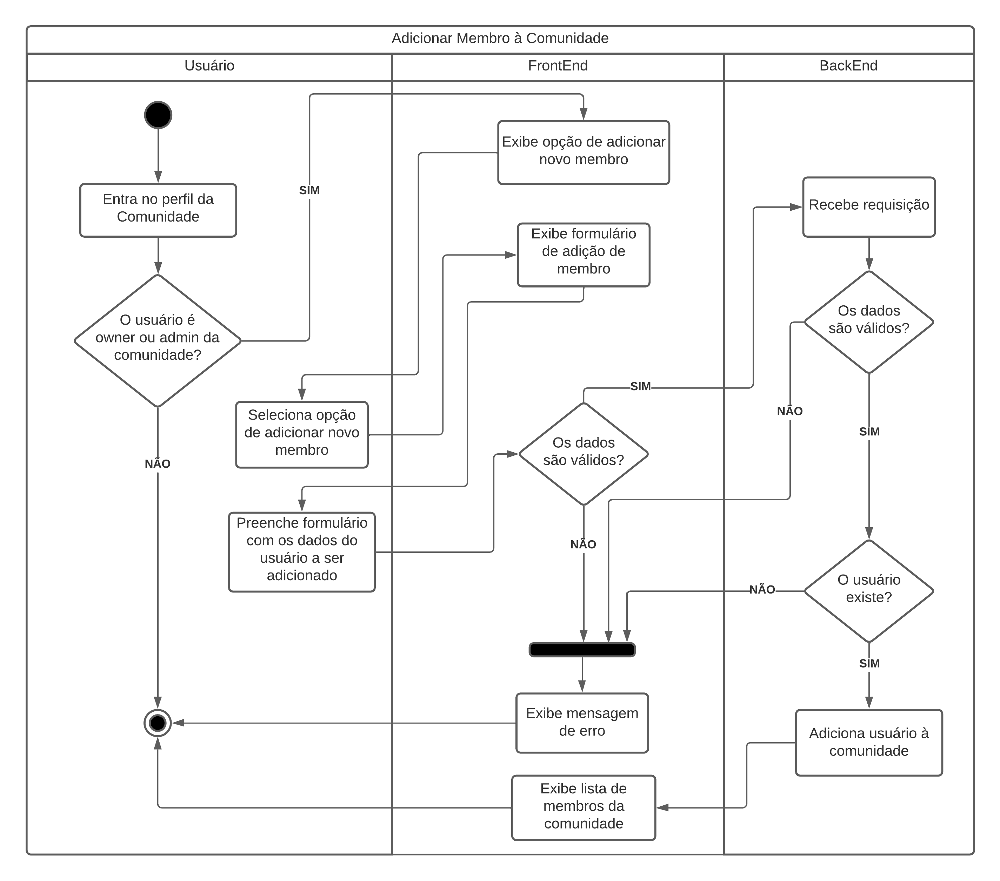
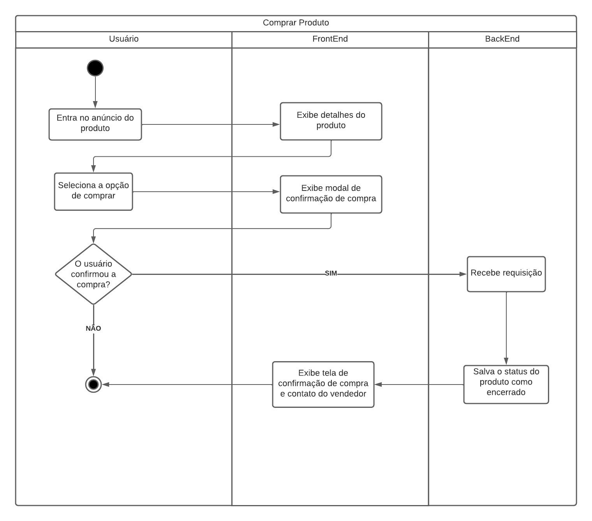

# Diagrama de Atividades

## 1. Histórico de versão

| Versão | Data       | Descrição                                           | Autor        |
| ------ | ---------- | --------------------------------------------------- | ------------ |
| 0.1    | 16/02/2022 | Criação do documento e adição dos diagramas Cadastrar de Usuário, Adicionar Usuário à Comunidade, Comprar Produto e Denunciar Vendedor | Thiago Mesquita |
| 0.1    | 21/02/2022 | Revisão do documento e adição das referência bibliográficas e complemento na introdução | Juliana Pereira |

## 2. Introdução

&emsp;&emsp;Diagrama de Atividades é um diagrama comportamental que mostra o fluxo de controle com ênfase na sequência e condições do fluxo. As ações coordenadas por atividades podem ser iniciadas pelo fim de outras atividades, porque objetos e dados se tornam disponível, ou porque eventos externos ao fluxo ocorrem.

Larman (2000, p. 474) descreve que um diagrama de atividades oferece uma notação rica para mostrar uma sequência de atividades, inclusive atividades paralelas. Ele pode ser aplicado em qualquer perspectiva ou propósito, mas é mais popular para visualizar fluxos de trabalho e processos de negócios, além de casos de uso.

&emsp;&emsp;Para o desenvolvimento do diagrama de atividades, foi necessário modularizar a utilização da aplicação em diversas atividades, para assim poder melhor descrever cada fluxo de atividades.

## 3. Diagrama de Atividades
### 3.1 Cadastro de Usuário

<figcaption>Imagem 1: Diagrama de atividades - Cadastro de Usuário.</figcaption>

### 3.2 Adicionar Usuário à Comunidade

<figcaption>Imagem 2: Diagrama de atividades - Adicionar Usuário à Comunidade.</figcaption>

### 3.3 Comprar Produto

<figcaption>Imagem 3: Diagrama de atividades - Comprar Produto.</figcaption>

 

### 3.4 Denunciar Vendedor

<figcaption>Imagem 4: Diagrama de atividades - Denunciar Vendedor.</figcaption>

 

## 4. Referências
> [1] SERRANO, Milene. Arquitetura e desenho de software - 06c - VideoAula - DSW - Modelagem - Diagrama de Atividades. Acesso em 16 de Fevereiro de 2022.

> [2] O que é diagrama de atividades UML?. Disponível em: <https://www.lucidchart.com/pages/pt/o-que-e-diagrama-de-atividades-uml>. Acesso em: 16 de Fevereiro de 2022.

> [3] LARMAN, Craig. Utilizando UML e padrões. Bookman Editora, 2000. Disponível em: <https://integrada.minhabiblioteca.com.br/books/9788577800476>. Acesso em 21 de fevereiro de 2022.