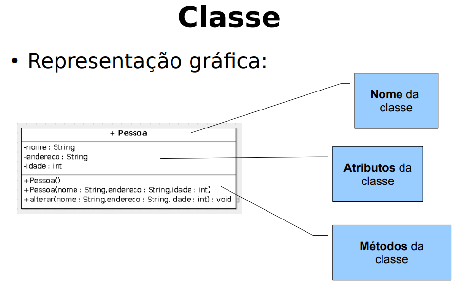
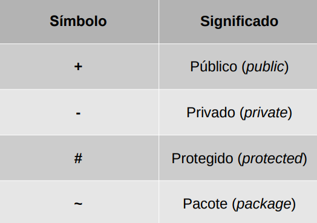
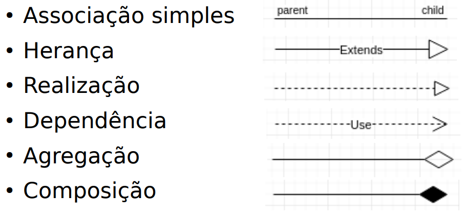
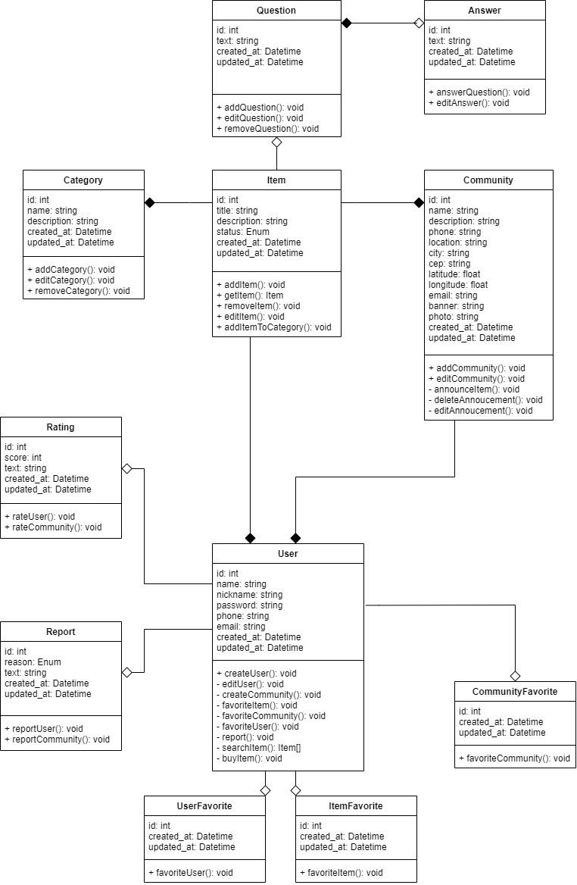

# Diagrama de Classes

## 1. Histórico de versão

| Versão |    Data    |                     Descrição                     |                     Autor                      |
| :----: | :--------: | :-----------------------------------------------: | :--------------------------------------------: |
|  0.1   | 20/02/2022 | Criação do documento | Mateus Gomes e Matheus Afonso |
|  0.2   | 21/02/2022 | Revisão do documento | Daniel Barcelos |

## 2. Introdução

&emsp;&emsp;O Diagrama de Classes é o diagrama mais utilizado da UML, e de acordo com Murta (p.2), este diagrama representa os tipos (classes) de objetos de um sistema, representando as propriedades desses tipos, as funcionalidades providas por esses tipos e os relacionamentos entre esses tipos. "As classes são os blocos de construção mais importantes de qualquer sistema orientado a objetos. Uma classe é uma descrição de um conjunto de objetos[...]" (JÚNIOR, 2020, p.3).

&emsp;&emsp;O Diagrama de Classes pode ser mapeado diretamente para uma linguagem de programação orientada a objetos, e com isso, pode-se dizer que este diagrama é a representação visual do código do sistema, colaborando muito na transição dos requisitos para o código de fato (MURTA, p.2).

## 3. Metodologia

&emsp;&emsp;Para a construção do diagrama, foi utilizada a plataforma [Draw.io](https://app.diagrams.net/), que permite a fácil criação de elementos UML e a edição simultânea entre várias pessoas. As classes representadas no diagrama são divididas em três compartimentos, sendo eles:

- Nome: contém apenas o nome da classe modelada;
- Atributos: contém os atributos que a classe possui em sua estrutura interna;
- Operações: contém os métodos de manipulação de dados e comunicação de uma classe com outras do sistema.

<figcaption>Imagem 1: Representação gráfica de uma classe.</figcaption>
<figcaption>Fonte: JÚNIOR (2020, p.6).</figcaption>

&emsp;&emsp;O diagrama também representa o encapsulamento dos atributos e das operações da classe. Este encapsulamento pode ser do tipo público, privado, protegido ou de pacote, cada um com seu respectivo símbolo que pode ser visto na imagem abaixo.

<figcaption>Imagem 2: Representação do encapsulamento no Diagrama de Classes.</figcaption>
<figcaption>Fonte: JÚNIOR (2020, p.10).</figcaption>

&emsp;&emsp;Além disso, os tipos de relacionamentos/associações entre as classes também estão presentes no diagrama, podendo ser uma associação simples, uma herança, uma realização, uma dependência, uma agregação ou uma composição, dependendo do símbolo utilizado.

<figcaption>Imagem 3: Representação dos relacionamentos no Diagrama de Classes.</figcaption>
<figcaption>Fonte: JÚNIOR (2020, p.7).</figcaption>

&emsp;&emsp;No contexto do projeto Garimpei, a abstração das classes e relacionamentos necessários para o produto foi feita com base nos requisitos já elicitados anteriormente, e também a partir da discussão entre os membros do grupo a respeito de como o sistema deve funcionar, como pode ser visto na imagem abaixo.

<figcaption>Imagem 4: Discussão dos membros do grupo sobre os requisitos do projeto Garimpei.</figcaption>

## 4. Resultados

&emsp;&emsp;Conforme o projeto for evoluindo e o grupo sentir a necessidade de criar outras versões deste diagrama, os resultados irão sendo publicados neste documento.

### 4.1 Diagrama de Classes V1

<figcaption>Imagem 5: Primeira versão do Diagrama de Classes do projeto Garimpei.</figcaption>
<figcaption>Autores: Mateus Gomes e Matheus Afonso</figcaption>

## 5. Referências

> [1] DevMedia. **Principais conceitos da Programação Orientada a Objetos**. Disponível em: <https://www.devmedia.com.br/principais-conceitos-da-programacao-orientada-a-objetos/32285>. Acesso em : 20/02/2022.

> [2] DevMedia. **Orientações básicas na elaboração de um diagrama de classes**. Disponível em: <https://www.devmedia.com.br/orientacoes-basicas-na-elaboracao-de-um-diagrama-de-classes/37224>. Acesso em: 20/02/2022.

> [3] Animalesco. **Diagrama de Classes**. Disponível em: <https://unbarqdsw2021-1.github.io/2021.1_G01_Animalesco_docs/#/pages/diagrama-classes>. Acesso em: 20/02/2022.

> [4] MURTA, Leonardo Gresta Paulino. **Diagrama de Classes**.

> [5] JÚNIOR, Edwar Saliba. **Diagrama de Classes**. 2020.