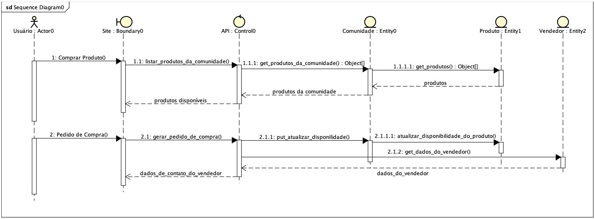
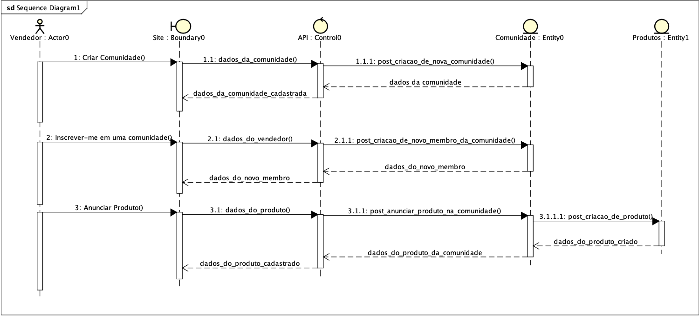

# Diagrama de Sequência

## 1. Histórico de versão

| Versão | Data       | Descrição            | Autor        |
| ------ | ---------- | -------------------- | ------------ |
| 0.1    | 20/02/2022 | Criação do documento | Paulo Victor |

## 2. Definição

Diagrama de sequência faz parte dos diagramas dinâmicos em notação UML e tem como objetivo principal demonstrar a sequência das mensagens(dados) entre objetos em uma interação. Resumidamente, o diagrama de sequência consiste em um grupo de objetos que são representados por linhas de vida e as mensagens que os mesmos trocam durante uma determinada interação. Por exemplo, um diagrama de sequência para um cenário de venda online poderia representar o cliente, os produtos, os vendedores e o sistema da loja. Toda a comunicação que acontece entre eles é representada pelas mensagens.

## 3. Diagramas de Sequência no Processo de Desenvolvimento

Conforme o documento sobre
[Diagrama de Sequências da IBM](https://www.ibm.com/docs/pt-br/rsm/7.5.0?topic=uml-sequence-diagrams), podemos utilizar esse diagrama nas seguintes etapas de desenvolvimento de um software:

| Fase       | Descrição                                                                                                                                                                                                                                                                                                                   |
| ---------- | --------------------------------------------------------------------------------------------------------------------------------------------------------------------------------------------------------------------------------------------------------------------------------------------------------------------------- |
| Análise    | Durante a fase de análise, é possível utilizar diagramas de seqüência para ilustrar as interações das instâncias de classe para realizar um caso de uso. Na fase de análise, os diagramas de seqüência podem ajudá-lo a identificar as classes necessárias em um sistema e o que os objetos da classe fazem nas interações. |
| Design     | Você pode refinar diagramas de seqüência para mostrar como um sistema completa as interações. Na fase de design, os diagramas de seqüência explicam como o sistema funciona para realizar as interações.                                                                                                                    |
| Construção | Durante o desenvolvimento de uma arquitetura de sistema, é possível utilizar diagramas de seqüência para mostrar o comportamento de padrões e mecanismos de design que o sistema utiliza.                                                                                                                                   |

## 4. Resultado

### Diagrama de Sequência - Compra de um produto

<figcaption>Imagem 1: Diagrama de sequência - Compra de um produto</figcaption>

### Diagrama de Sequência - Venda de um produto

<figcaption>Imagem 1: Diagrama de sequência - Venda de um produto</figcaption>

## 4. Referências

> Diagramas de Seqüência. Disponível em:
> [https://www.ibm.com/docs/pt-br/rsm/7.5.0?topic=uml-sequence-diagrams](https://www.ibm.com/docs/pt-br/rsm/7.5.0?topic=uml-sequence-diagrams). Data de acesso: 20/02/2022

> O que é um diagrama de sequência UML?. Disponível em:
> [https://www.lucidchart.com/pages/pt/o-que-e-diagrama-de-sequencia-uml](https://www.lucidchart.com/pages/pt/o-que-e-diagrama-de-sequencia-uml). Data de acesso: 16/02/2022

> UML Sequence Diagrams. Disponível em: [https://www.uml-diagrams.org/sequence-diagrams.html](https://www.uml-diagrams.org/sequence-diagrams.html). Data de acesso: 16/02/2022
