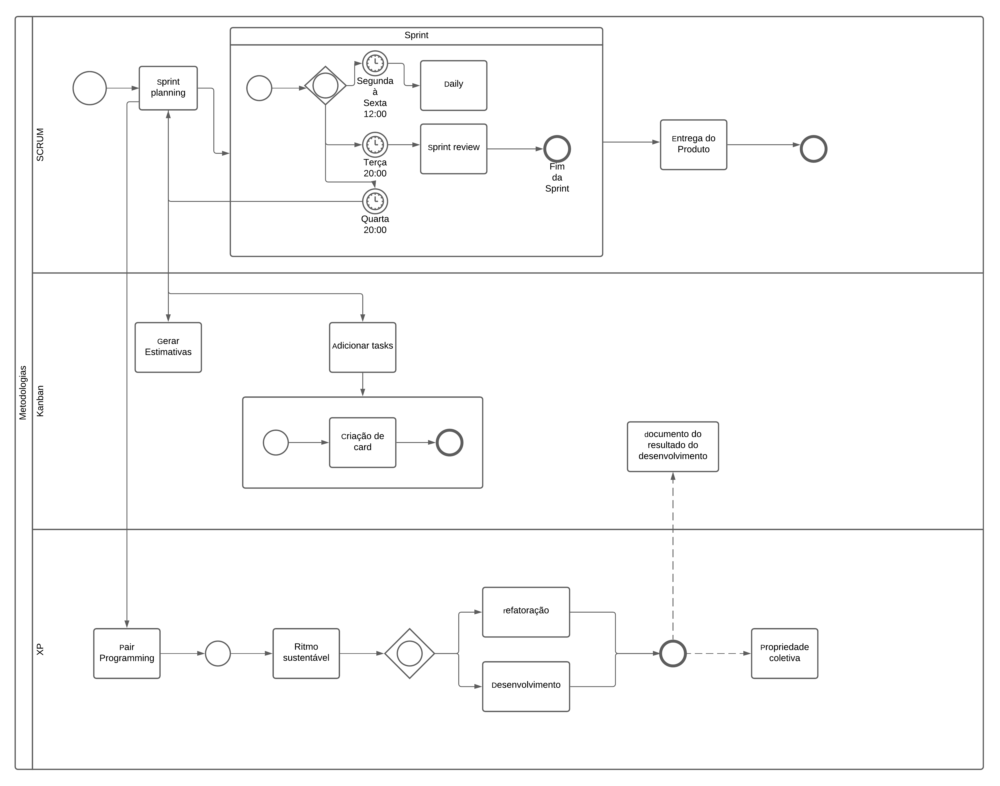

# Modelagem BPMN

## 1. Histórico de versão

| Versão | Data       | Descrição                                           | Autor        |
| ------ | ---------- | --------------------------------------------------- | ------------ |
| 0.1    | 04/02/2022 | Criação do documento sobre modelagem BPMN e a primeira versão do BPMN do projeto | Thiago Mesquita |

## 2. Introdução

&emsp;&emsp;Business Process Modeling Notation (BPMN) é uma notação gráfica, padrão OMG, que tem por objetico prover recursos e elementos para modelar os processos de negócio. O seu principal objetivo é fornecer uma representação que seja facilmente compreensível por todos os envolvidos em um projeto, ou seja, sua intenção é padronizar um modelo diante de outras notações e pontos de vista diferentes.

&emsp;&emsp;Neste documento visamos representar as metodologias adotadas no projeto, XP, SCRUM, e Kanban, utilizando o BPMN.

## 3. BPMN - Versão 1

<figcaption>Imagem 1: BPMN.</figcaption>

## 4. Referência bibliográfica

> - SERRANO, Milene. BPMN, 2021. Videoaulas disponibilizadas no moodle da disciplina de Arquitetura e Desenho de Software do curso de Engenharia de Software da UnB, FGA. Acesso em: 01 de Agosto de 2021.
> - Business Process Model and Notation (BPMN) Version 2.0.2. OMG (2013). Disponível em: https://www.omg.org/spec/BPMN. Acesso em: 04 de Fevereiro de 2022.
