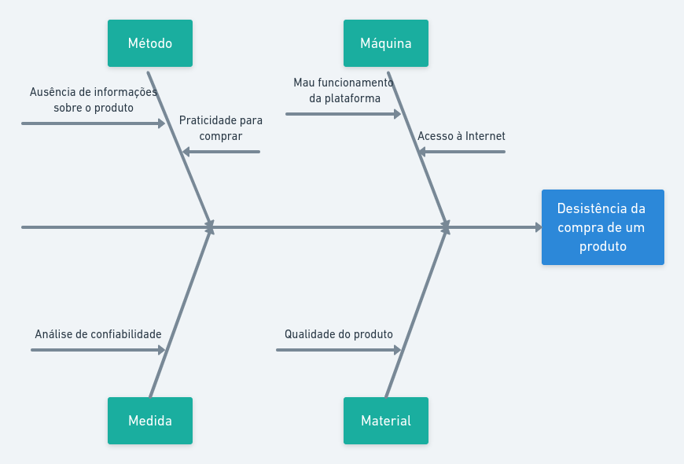

# Diagrama de Causa e Efeito

## 1. Histórico de versão

| Versão | Data       | Descrição                                           | Autor        |
| ------ | ---------- | --------------------------------------------------- | ------------ |
| 0.1    | 04/02/2022 | Criação do documento | Daniel Barcelos |

## 2. Definição

&emsp;&emsp;O diagrama de causa e efeito, também conhecido como diagrama Ishikawa ou diagrama de espinha de peixe é uma ferramenta visual que auxilia na identificação de causas de um determinado problema.

## 3. Metodologia

&emsp;&emsp;Uma das principais formas de aplicação do diagrama é através do método 6M. Esse método busca agrupar as causas em 6 diferentes categorias, sendo elas:

- Método: causas relacionadas ao processo e aos procedimentos.
- Mão de Obra: causas relacionadas ao pessoal envolvido com o efeito.
- Máquina: causas relacionadas às máquinas e equipamentos.
- Material: causas relacionadas aos materiais e insumos usados no processo.
- Medida: causas relacionadas a como o processo é mensurado.
- Meio Ambiente: características do ambiente em que o processo ocorre.

## 4. Resultado
&emsp;&emsp;Na construção do diagrama foi aplicado 4M's sendo eles método, máquina, medida e material:

<figcaption>Imagem 1: Diagrama de Causa e Efeito</figcaption>

## 5. Referências

> [1] Entenda o que é e como construir um diagrama de Ishikawa para identificar problemas. Disponível em: <https://www.voitto.com.br/blog/artigo/diagrama-de-ishikawa>. Acesso em: 4 de Fevereiro de 2022.

> [2] Diagrama de Ishikawa (Ferramenta da Qualidade): Teoria + Exemplo Prático. Disponível em: <https://www.youtube.com/watch?v=U-0qzmFqH-0>. Acesso em: 4 de Fevereiro de 2022.