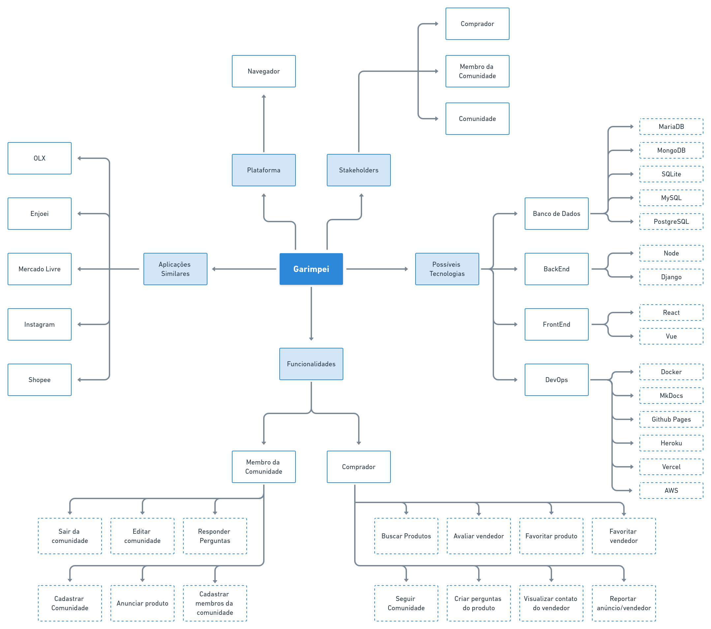

# Mapa Mental

## 1. Histórico de versão

| Versão | Data       | Descrição                                           | Autor        |
| ------ | ---------- | --------------------------------------------------- | ------------ |
| 0.1    | 02/02/2022 | Criação do documento                                | Mateus Gomes |
| 0.2    | 02/02/2022 | Elaboração do mapa mental                           | Mateus Gomes e Paulo Victor |

## 2. Definição

De acordo com Beluzzo (2006), os mapas mentais são as técnicas que servem para tornar visíveis e claros as ideias chaves em que os gestores devem se centrar para uma atividade de busca da solução de problemas, de pesquisa, de tomadas de decisão em qualquer tipo de organização. Mesmo que o mapa mental seja uma técnica informal que envolve ideias vagas no seu desenvolvimento, ele produz resultados que, ao decorrer do projeto, se solidificam e contribuem para a estruturação dos fluxos e da infraestrutura do projeto.

## 3. Metodologia

Existem diversas metodologias para elaborar um mapa mental, a abordagem feita pelo grupo foi a seguinte:

- Etapa 1: Uma ideia central representada no centro do diagrama.
- Etapa 2: Ligue ramos entre a ideia principal e as ideias secundárias, terciárias e assim sucessivamente.
- Etapa 3: Escreva um única palavra chave por ramo.
- Etapa 4: Utilize imagens durante o processo.

## 4. Resultado

O Mapa Mental elaborado pelo grupo possui o projeto como ideia principal, e a partir dela foram ligadas as ideias de Plataforma, Stakeholders, Possíveis Tecnologias, Funcionalidades e Aplicações Similares, que são ideias que se relacionam com o fluxo do produto e também com o desenvolvimento do projeto.

<figcaption>Imagem 1: Mapa Mental do projeto Garimpei</figcaption>

## 5. Referências

> [1] BELLUZZO, Regina Célia Baptista. O Uso de Mapas Conceituais e Mentais como Tecnologia de Apoio à Gestão da Informação e da Comunicação: uma área interdisciplinar da competência em informação. Revista Brasileira de Biblioteconomia e Documentação: Nova Série, São Paulo, v 2, n 2, dez 2006.

> [2] Silva, Milena da Costa. Mapas mentais: uma ferramenta para o desenvolvimento da competência em informação – Rio de Janeiro, 2010.

> [3] Mapa Mental. **Animalesco**. Diseponível em: <https://unbarqdsw2021-1.github.io/2021.1_G01_Animalesco_docs/#/pages/mapa-mental>. Acesso em: 2 de fevereiro de 2022.