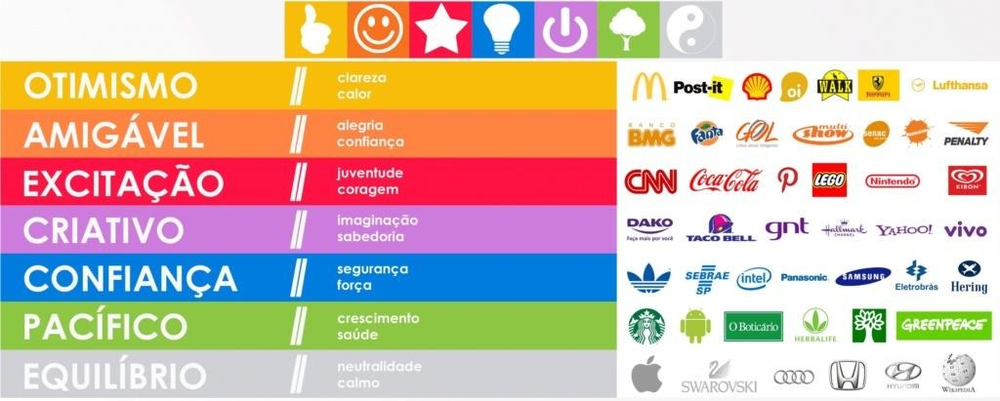
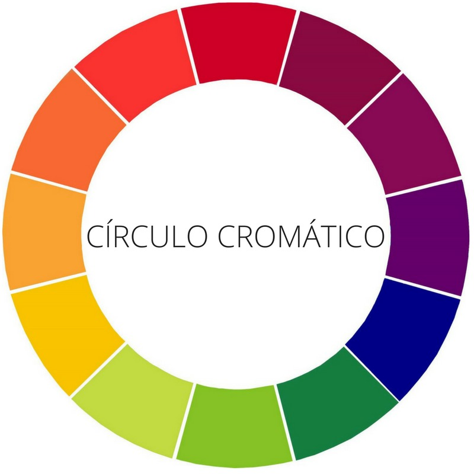
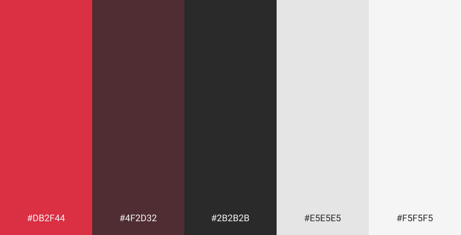

# Manual de Identidade Visual

## 1. Histórico de versão

| Versão | Data       | Descrição                                           | Autor        |
| ------ | ---------- | --------------------------------------------------- | ------------ |
| 0.1    | 03/02/2022 | Criação do documento                                | Vinicius Saturnino |

## 2. Introdução

O seguinte documento objetiva informar e detalhar tecnicamente a construção do conjunto de elementos que representam visualmente a aplicação.

## 3. Apresentação da Identidade Visual

Autores: Juliana Pereira e Vinicius Saturnino

<iframe src="https://docs.google.com/presentation/d/1IG_koRCkRzvL04qjJ5rWD1za1Zbe9_kNKxk-MDXI7cw/embed?start=true&loop=true&delayms=3000" frameborder="0" width="960" height="569" allowfullscreen="true" mozallowfullscreen="true" webkitallowfullscreen="true"></iframe>

## 4. Detalhamentos e Justificativas

### 4.1. Nome da Aplicação

A escolha do nome da aplicação foi feita em grupo com o objetivo de encontrar um termo que fizesse sentido dentro do contexto da aplicação em português.

### 4.2. Fontes

As fontes que serão utilizadas no projeto são:
- Poppins
- Roboto

### 4.3 Paleta de cores

As cores foram selecionadas observando características do produto e sua finalidade, baseado na psicologia das cores. Como a aplicação é baseada fortemente na confiança entre os usuários e por se tratar de venda de roupas, acessórios em geral a cor primária escolhida foi o vermelho.

Nossa escolha foi baseada nos pontos citados anteriormente fazendo a escolha entre o vermelho e laranja, onde acabamos optando pelo vermelho que, quando aplicada no mundo do marketing, representa a juventude e coragem.

A cor secundária escolhida foi a cor análoga ao vermelho no círculo cromático para boa composição na aplicação.

Adicionando o preto e o branco o resultado final da paleta de cores da aplicação foi:

Autores: Vinicius Saturnino e Juliana Pereira

Primária: #DB2F44,
Secundária: #4F2D32.
