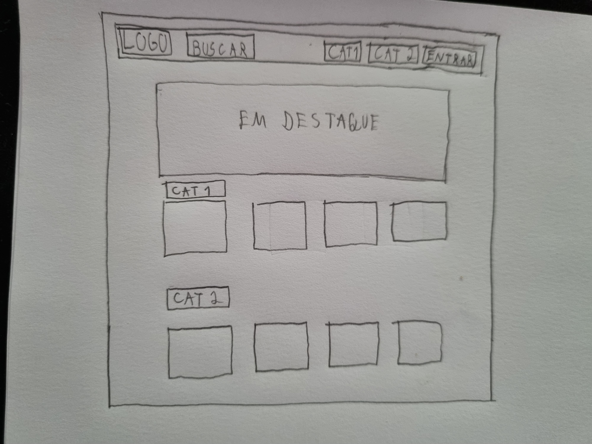
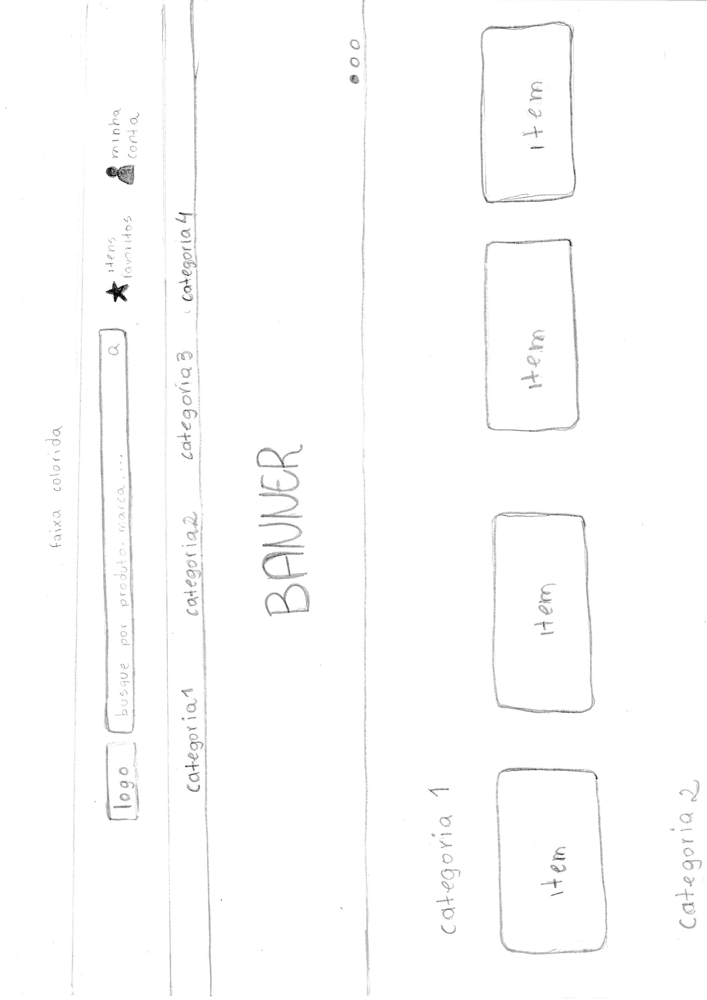
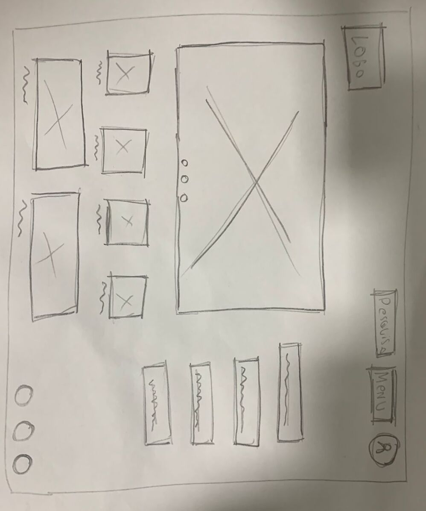
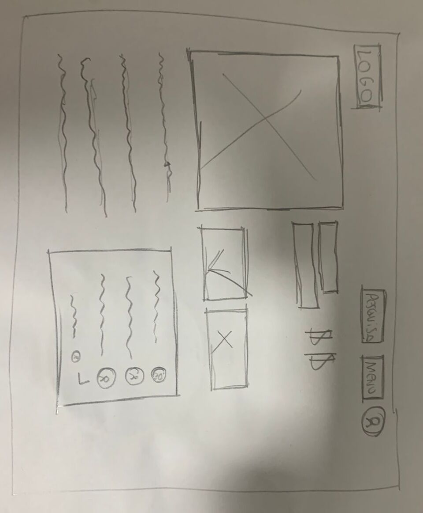
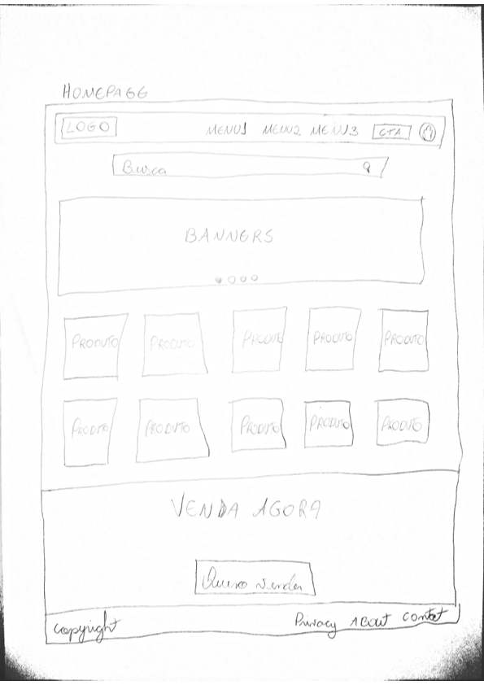
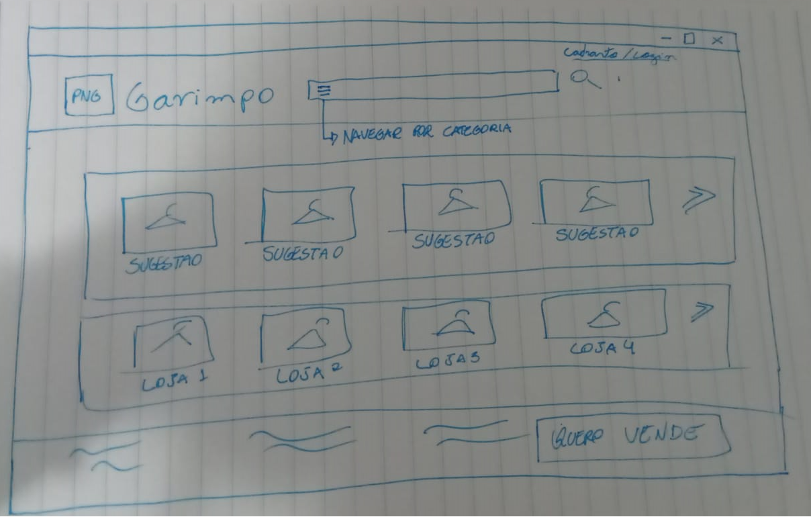
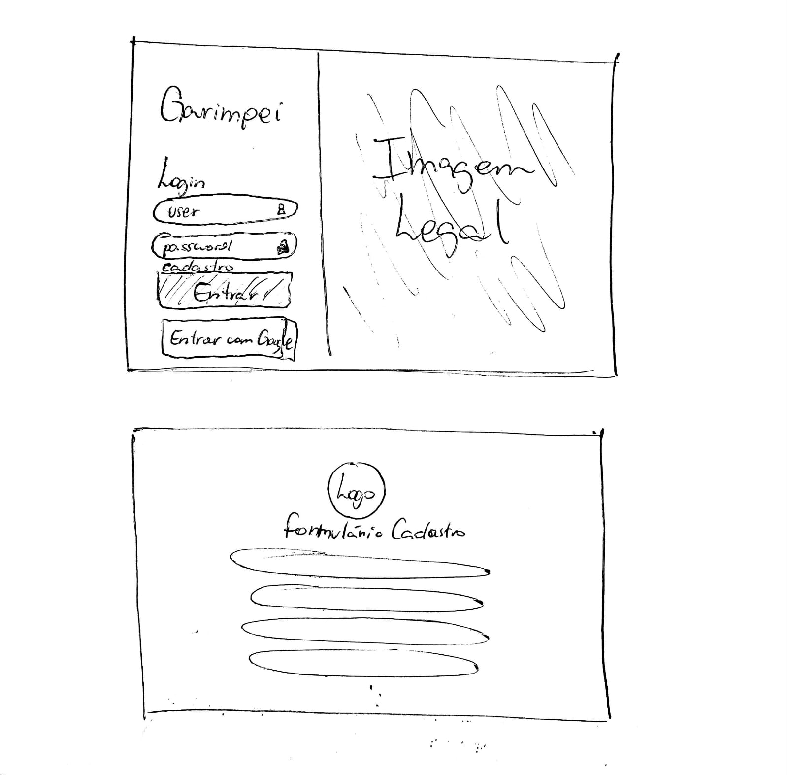
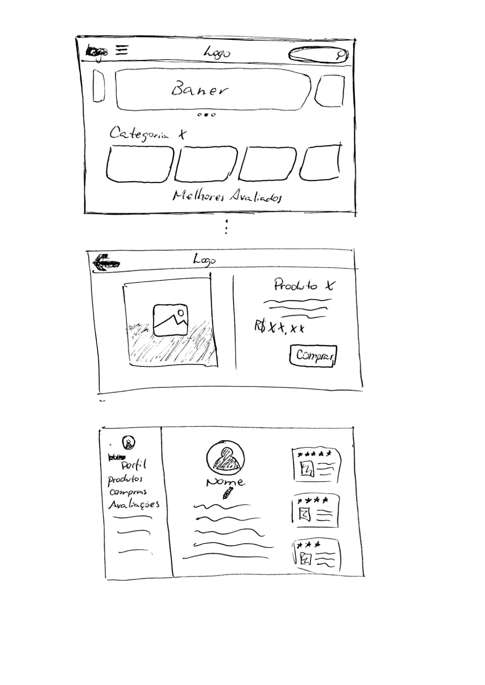

# Protótipo de baixa fidelidade

## 1. Histórico de versão

| Versão | Data       | Descrição                                           | Autor        |
| ------ | ---------- | --------------------------------------------------- | ------------ |
| 0.1    | 02/02/2022 | Criação do documento de exposição dos protótipos elaborados | Victor Gonçalves |
| 0.2    | 02/02/2022 | Centralização das tabelas | Matheus Afonso |

## 2. Definição

Um protótipo de baixa fidelidade é aquele que não se assemelha muito ao produto final; ele utiliza, por exemplo, materiais diferentes da versão final pretendida, como papel e cartolina, ao invés do material utilizado no produto final. No protótipo de baixa fidelidade, apenas os elementos principais são representados, a saber: apenas algumas características visuais do produto final são contempladas, bem como apenas elementos-chave do conteúdo final são incluídos.

## 3. Metodologia

Cada integrante do grupo elaborou seu próprio protótipo de baixa fidelidade a fim de reunir o máximo de ideias e visões possíveis para a sintetização de futuros protótipos e também do produto final. Nos artefatos gerados se encontram prototipos de papel e também protótipos eletrônicos interativos.

## 4. Resultados

### Protótipo 1

> Autor: Daniel Barcelos

### Protótipo 2

> Autor: Denys Rogeres

### Protótipo 3

> Autora: Juliana Valle

### Protótipo 4

> Autor: Matheus Afonso

### Protótipo 5

> Autor: Mateus Gomes

### Protótipo 6

> Autor: Paulo Victor

### Protótipo 7

> Autor: Thiago Mesquita

### Protótipo 8

> Autor: Victor Gonçalves

<iframe style="border: 1px solid rgba(0, 0, 0, 0.1);" width="800" height="450" src="https://www.figma.com/embed?embed_host=share&url=https%3A%2F%2Fwww.figma.com%2Fproto%2FyNLgoTJq8ADrsuzvDgxotT%2FPrototipo_baixa_garimpei%3Fnode-id%3D2%253A2%26scaling%3Dmin-zoom%26page-id%3D0%253A1%26starting-point-node-id%3D2%253A2" allowfullscreen></iframe>

### Protótipo 9

> Autor: Vinicius Saturnino

## Referências

[1] PREECE, Jennifer; ROGERS, Yvonne; SHARP, Helen. Interaction design: beyond human-computer interaction: 3. Ed. United States. John Wiley & Sons, Inc.

[2] BARBOSA, Simone; SILVA, Bruno. Interação Humano-Computador. Rio de Janeiro: Elsevier Editora Ltda, 2010.

[3] BABICH, Nick. Prototyping 101: The Difference between Low-Fidelity and High-Fidelity Prototypes and When to Use Each. **Adobe Blog**, 2017. Disponível em: <https://blog.adobe.com/en/publish/2017/11/29/prototyping-difference-low-fidelity-high-fidelity-prototypes-use>. Acesso em: 02 fev. de 2022.