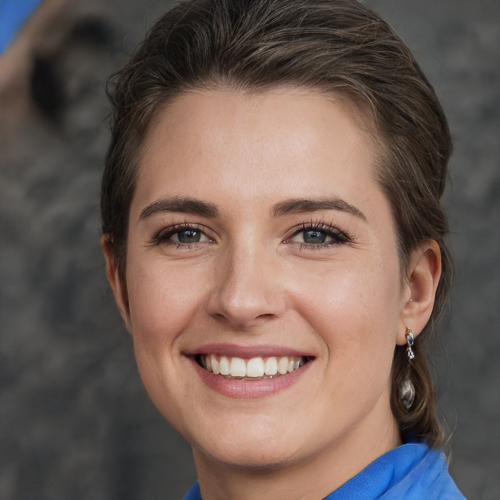

# Personas

## 1. Histórico de versão

| Versão | Data       | Descrição                                           | Autor         |
| ------ | ---------- | --------------------------------------------------- | ------------  | 
| 0.1    | 02/02/2022 | Criação da documentação relacionada as personas     | Juliana Valle |
| 0.2    | 02/02/2022 | Criação das personas                                | Juliana Valle |
| 0.3    | 02/02/2022 | Criação das antipersonas                            | Mateus Gomes  |
| 0.4    | 02/02/2022 | Adição de imagens para as personas e antipersonas    | Mateus Gomes  |
| 0.5    | 02/02/2022 | Adição das referências                              | Mateus Gomes e Juliana Valle |

## 2. Definição
Uma persona é um personagem fictício, arquétipo hipotético de um grupo de usuários reais, criada para descrever um usuário típico. As personas são definidas principalmente por seus objetivos, que são determinados num processo de refinamentos sucessivos durante a investigação inicial do domínio de atividade do usuário.

## 3. Personas

### 3.1 Mel Fogaça

<figcaption>Imagem 1: Persona Mel Fogaça</figcaption>

- Idade: 35 anos.
- Sexo: Feminino.
- Profissão: Nutricionista.
- Escolaridade: Ensino Superior Completo.
- Expectativas: Deseja diminuir o impacto ambiental reutilizando e ressinificando itens usados.

Mel tem 35 anos, divorciada, formada em Nutrição e possui o próprio consultório. Mel mora com os dois filhos adolescentes. Vale destacar que Mel leva o estilo de vida vegano e minimalista. Todas suas aquisições, tanto roupas como mobilias, são pensadas para diminuir o impacto da indústria no meio ambiente.

### 3.2 Karen Silva

<figcaption>Imagem 2: Persona Karen Silva</figcaption>

- Idade: 53 anos.
- Sexo: Feminino.
- Profissão: Empregada doméstica.
- Escolaridade: Ensino Fundalmental Completo.
- Expectativas: Deseja encontrar roupas e itens diversos de baixo custo.

Karen tem 53 anos, casada e trabalha como empregada doméstica. Karen mora com seus cinco filhos e marido. A família de 7 pessoas vive com pouco mais que dois salários mínimos. Por isso, Karen necessita comprar roupas para seus filhos e artefatos para casa com preço mais acessível.

### 3.3 Evandro Lins

<figcaption>Imagem 3: Persona Evandro Lins</figcaption>

- Idade: 20 anos.
- Sexo: Masculino.
- Profissão: Estagiário.
- Escolaridade: Cursando Ensino Superior.
- Expectativas: Deseja comprar itens mais baratos e não se importa de serem de segunda mão.

Evandro tem 20 anos, solteiro, é estudante de Contablidade e faz estágio na área. Evandro mora com os pais, mas quer buscar sua idependência logo. Ele já procura móveis baratos para mobiliar sua futura casa e roupas em conta para ter um guarda-roupas diversificado.

## 4. Antipersonas

### 4.1 Carlos Eduardo

<figcaption>Imagem 4: Antipersona Carlos Eduardo</figcaption>

- Idade: 31 anos.
- Sexo: Masculino.
- Profissão: Vendedor Autônomo.
- Escolaridade: Superior Completo em Marketing Digital
- Expectativas: Deseja comprar várias quantidades do mesmo item para revendê-los.

Carlos tem 31 anos, casado e trabalha revendendo produtos por meio de sua página no Instagram. Carlos mora com sua esposa e seu filho pequeno. Carlos costuma buscar plataformas para comprar diversas quantidade do mesmo item para revendê-los em sua loja autônoma.

### 4.2 Leandro Rocha

<figcaption>Imagem 5: Antipersona Leandro Rocha</figcaption>

- Idade: 44 anos.
- Sexo: Masculino.
- Profissão: Enegenheiro Civil
- Escolaridade: Superior completo em Engenharia Civil
- Expectativas: Deseja comprar coisas novas de fábrica.

Leandro tem 44 anos, casado, é Engenheiro Civil em uma empresa de sua cidade. Leandro mora com sua esposa e seus 2 filhos. Leandro possui um bom poder aquisitivo e gosta sempre de comprar suas coisas novas de fábrica, para evitar problemas e possuir garantia.

## 5. Referências

> [1] Random Face Generator (This Person Does Not Exist). ThisPersonDoesNotExist. Disponível em: <https://this-person-does-not-exist.com/en>. Acesso em: 2 de Fevereiro de 2022.

> [2] BARBOSA, Simone; SILVA, Bruno. Interação Humano-Computador: Cap. 6 – Organização do Espaço de Problema.