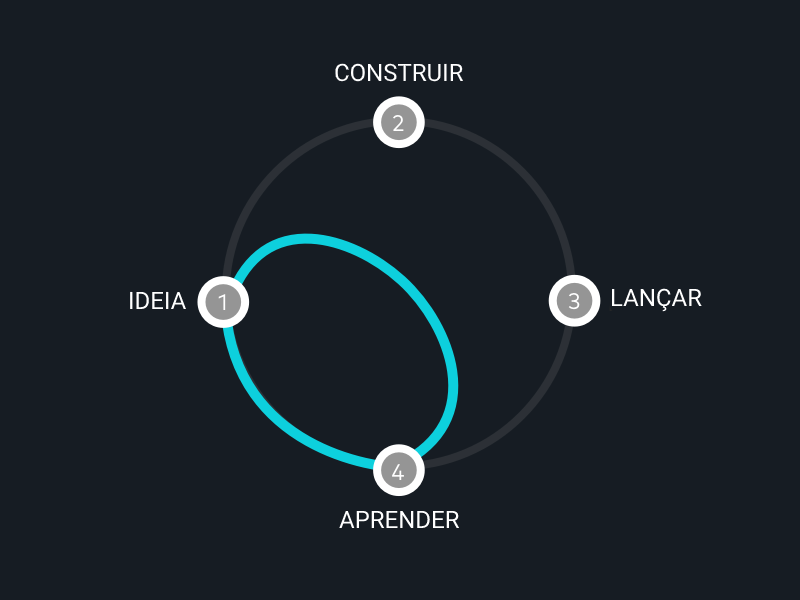
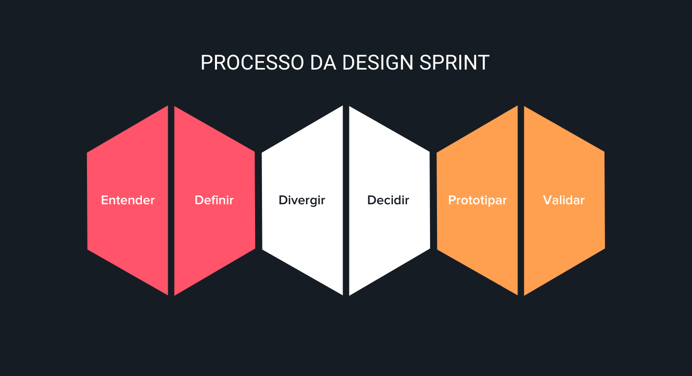
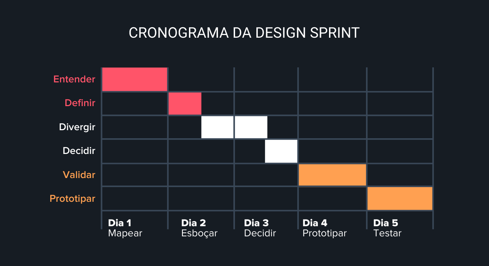

# Design Sprint

## 1. Histórico de versão

| Versão | Data       | Descrição                        | Autor        |
| ------ | ---------- | -------------------------------- | ------------ |
| 0.1    | 04/02/2022 | Criação do documento                             | Juliana Valle |
| 0.2    | 04/02/2022 | Adição referências ao documento             | Juliana Valle |
| 0.3    | 04/02/2022 | Adição de resultados ao documento             | Juliana Valle |
| 0.4    | 04/02/2022 | Revisão do documento             | Mateus Gomes |

## 2. Introdução
O nome "Design Sprint" combina duas palavras em inglês que descrevem o funcionamento do método: 

- Design: Relacionado ao design, construção, desenho.
- e Sprint: Relacionado à velocidade. 

O método foi desenvolvido pela Alphabet Inc e Google Ventures, o braço de capital de risco do Google, para simplificar projetos e validar transações antes de investir tempo significativo e outros recursos. 

## 3. Definição
A Design Sprint é um processo de cinco dias que responde às principais questões de negócios projetando, prototipando e testando ideias com os clientes.

Trabalhando em conjunto em sprints, pode-se diminuir o ciclo de debates prolongados ​​e comprimir meses em uma semana. Ao invés de aguardar o menor lançamento do produto para verificar se a ideia é eficaz, pode obter dados claros de protótipos reais. Além disso, antes de assumir qualquer compromisso caro, pode-se avançar para o futuro para ver o produto concluído e a reação dos clientes.

No desenvolvimento, a Design Sprint assume o papel no desenvolvimento de produtos. Ela age durante o conceito, ideia, processo de construção, bem como previne falhas e prevê pontos de melhoria antes que o produto final seja implementado.

<figcaption>Imagem 1: Ilustração do encurtamento do ciclo por meio de Design Sprint</figcaption>

A abordagem inclui etapas de planejamento, prototipagem e testes, com interatividade, praticidade e colaboração muito claras. O método é executado dentro de uma semana. Diferentes atividades acontecem em cada um dos cinco dias que compõem a metodologia da Design Sprint e o processo é composto por 3 estágios, no qual cada um é dividido em 2 etapas com 6 passos no total:

- Entendimento (Understand);
- Definição (Define);
- Divergir (Diverge);
- Decidir (Decide);
- Protótipo (Prototype);
- Validação (Validate).

<figcaption>Imagem 2: Processo da Design Sprint</figcaption>

Sendo assim, a proposta da Design Sprint é finalizar esses processos em 5 dias. Portanto, dentro de um cronograma tem-se a seguinte visão:

<figcaption>Imagem 3: Cronograma da Design Sprint</figcaption>

## 4. Resultados
O método foi utilizado de modo adaptado pela equipe da seguinte forma:

- <strong>Entendimento:</strong> nessa processo a equipe se reuniu e desenvolveu a técnica de [Brainstorming](https://unbarqdsw2021-2.github.io/2021.2_G5_Garimpei/content/elicitacao/brainstorming/). A técnica de [Brainstorming](https://unbarqdsw2021-2.github.io/2021.2_G5_Garimpei/content/elicitacao/brainstorming/) pela equipe possibilitou a criação do documento da técnica do [Mapa Mental](https://unbarqdsw2021-2.github.io/2021.2_G5_Garimpei/content/pre_rastreabilidade/mapa_mental/). Com isso, pode-se obter uma uniformidade e consenso sobre a ideia principal do projeto. Além disso, nessa etapa também foram desenvolvidos [Rich Picture](https://unbarqdsw2021-2.github.io/2021.2_G5_Garimpei/content/pre_rastreabilidade/rich_picture/) por cada membro da equipe.
- <strong>Definição:</strong>  Nessa etapa, cada membro da equipe produziu individualmente um [Protótipo de Baixa Fidelidade](https://unbarqdsw2021-2.github.io/2021.2_G5_Garimpei/content/produto/prototipo_baixa_fidelidade/) para a definição de caracteríristicas visuais do produto final e elementos-chaves que estarão presentes. Ademais, nessa etapa também foram desenvolvidas [Personas](https://unbarqdsw2021-2.github.io/2021.2_G5_Garimpei/content/elicitacao/personas/)para ter uma delimitação do público-alvo que o projeto irá abrangir.
- <strong>Decisão:</strong>  Nessa etapa foi feita a decisão e elaboração de um [Rich Picture](https://unbarqdsw2021-2.github.io/2021.2_G5_Garimpei/content/pre_rastreabilidade/rich_picture/) final. 
- <strong>Prototipação:</strong>  Com base nos artefatos já produzidos, nessa etapa foi confeccionado o [Protótipo de Média Fidelidade](https://unbarqdsw2021-2.github.io/2021.2_G5_Garimpei/content/produto/prototipo_media_fidelidade/). Em conjunto com a produção do [Protótipo de Média Fidelidade](https://unbarqdsw2021-2.github.io/2021.2_G5_Garimpei/content/produto/prototipo_media_fidelidade/), foi elaborado o [Manual de Identidade Visual](https://unbarqdsw2021-2.github.io/2021.2_G5_Garimpei/content/produto/identidade_visual/). Após a finalização de ambos, foi produzido o [Protótipo de Alta Fidelidade](https://unbarqdsw2021-2.github.io/2021.2_G5_Garimpei/content/produto/prototipo_alta_fidelidade/).

## 5. Referências

> [1] The Design Sprint. Disponível em: <https://www.gv.com/sprint/>. Acesso em: 4 de Fevereiro de 2022.

> [2] Design Sprint: o que é, como funciona e vantagens da metodologia. Disponível em: <https://ateliware.com/blog/design-sprint-no-desenvolvimento-de-softwares?gclid=Cj0KCQiAuvOPBhDXARIsAKzLQ8GBp77Z3T5Q7ZHpN18tct1dc-59huRH4C9jG-KGBPLw21Nx1uxDP5EaAog3EALw_wcB/>. Acesso em: 4 de Fevereiro de 2022.

> [3] Design Sprint: Como Acelerar o Desenvolvimento de um Produto?. Disponível em: <https://medium.com/aela/design-sprint-como-acelerar-o-desenvolvimento-de-um-produto-767997de27c9>. Acesso em: 4 de Fevereiro de 2022.
