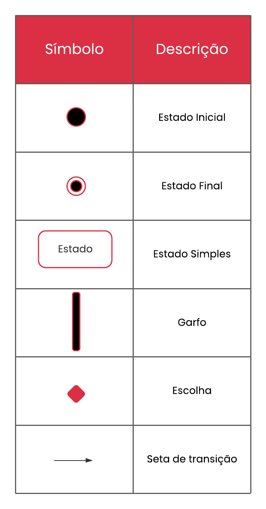
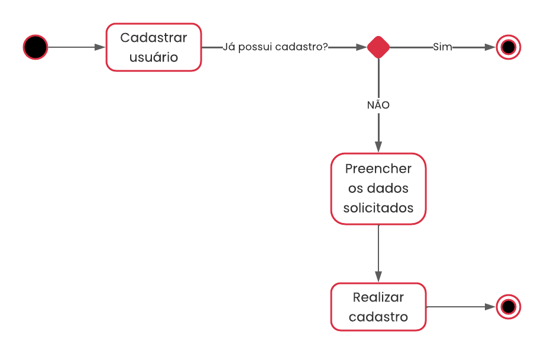
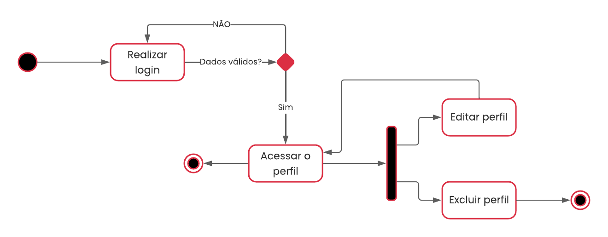
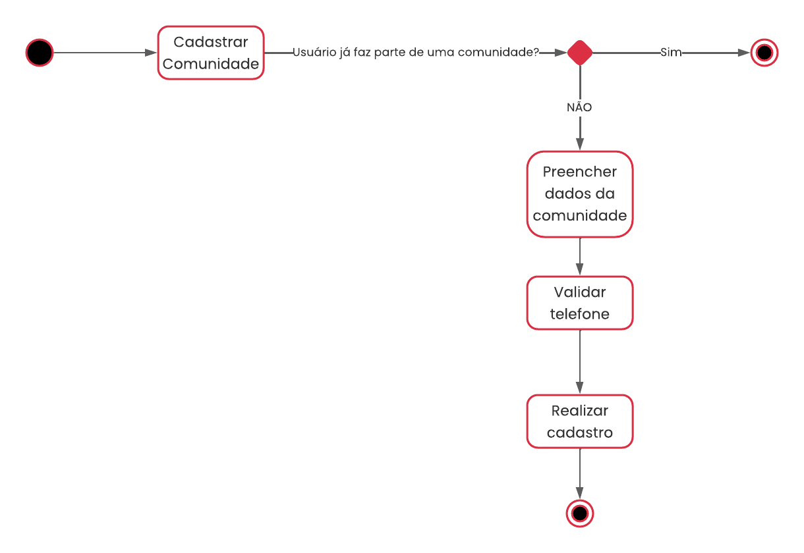
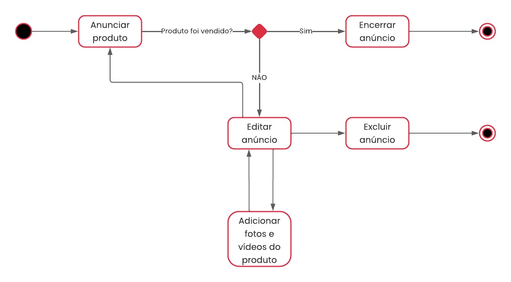
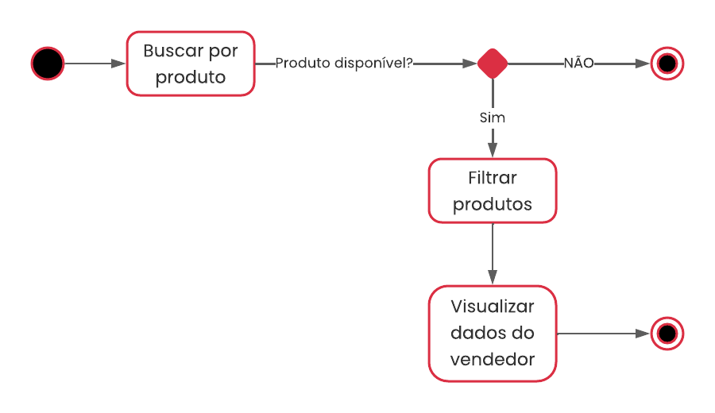

# Diagrama de Estados

## 1. Histórico de versão

| Versão | Data       | Descrição                                           | Autor        |
| ------ | ---------- | --------------------------------------------------- | ------------ |
| 0.1    | 18/02/2022 | Criação do documento e adição dos diagramas de estados | Daniel Barcelos e Juliana Pereira |
| 0.2    | 20/02/2022 | Revisão do Documento | Vinicius Saturnino |
| 0.3    | 21/02/2022 | Adicionando referência bibliográfica na introdução | Juliana Pereira |
| 0.4    | 21/02/2022 | Revisão do documento e ortografia | Mateus Gomes e Matheus Afonso |

## 2. Introdução

&emsp;&emsp; O diagrama de estado, também conhecido como diagrama de máquina de estado, é um tipo de diagrama UML que representa o comportamento e uma visão dinâmica de um objeto, especificando a sequência de eventos pela qual esse objeto passa e suas respostas. Segundo Lerman (2000, p. 481), um diagrama de máquina de estados mostra o ciclo de vida de um objeto sendo os eventos, transições e os estados que ele está entre esses eventos. Todavia, não é necessário ilustrar todos os eventos possíveis. Se ocorrer um evento que não esteja representado no diagrama, ele será ignorado no que diz respeito ao diagrama de estado.  Dessa forma, pode-se criar um diagrama de estados que descreve o ciclo de vida de um objeto em níveis de detalhe arbitrariamente complexos ou simples, dependendo da necessidade.
Lerman (2000, p. 481), explica que: 

* Um <strong>evento</strong> é uma ocorrência significativa ou digna de nota. 
* Um <strong>estado</strong> é a condição de um objeto em determinado momento no tempo entre os eventos.
* Uma <strong>transição</strong> é um relacionamento entre dois estados, indicando que, quando um evento ocorre, o objeto muda do estado anterior para o estado subsequente.

### 2.1 Legenda

<figcaption>Imagem 1: Legenda do Diagrama de Estado .</figcaption>
<figcaption>Autora: Juliana Pereira</figcaption>

## 3. Diagrama de Estados

### 3.1 Cadastro de Usuário

<figcaption>Imagem 2: Diagrama de estados - Cadastro de Usuário.</figcaption>
<figcaption>Autor: Daniel Barcelos</figcaption>

### 3.2 Perfil de Usuário

<figcaption>Imagem 3: Diagrama de estados - Perfil de Usuário.</figcaption>
<figcaption>Autor: Daniel Barcelos</figcaption>

 

### 3.3 Cadastro de Comunidade

<figcaption>Imagem 4: Diagrama de estados - Cadastro de Comunidade.</figcaption>
<figcaption>Autora: Juliana Pereira</figcaption>

### 3.4 Perfil de Comunidade

<figcaption>Imagem 5: Diagrama de estados - Perfil de Comunidade.</figcaption>
<figcaption>Autora: Juliana Pereira</figcaption>

### 3.5 Anunciar Produto

<figcaption>Imagem 6: Diagrama de estados - Anunciar Produto.</figcaption>
<figcaption>Autora: Juliana Pereira</figcaption>

 

### 3.6 Buscar Produto

<figcaption>Imagem 7: Diagrama de estados - Buscar Produto.</figcaption>
<figcaption>Autor: Daniel Barcelos</figcaption>

## 4. Rastreabilidade

&emsp;&emsp;Os diagramas de estado foram construídos com base nas histórias de usuário que constam no [backlog do produto](./backlog.md).

| Diagrama de Estado  | História de Usuário  | Descrição  |
|----------------------|------------|------------|
| [Cadastro de Usuário](#31-cadastro-de-usuario)                 | US01                 | Eu, como usuário, gostaria de realizar cadastro, para utilizar o sistema  |
| [Perfil de Usuário](#32-perfil-de-usuario)                 | US02                 | Eu, como usuário, gostaria de realizar login, para iniciar minha sessão  |
| [Perfil de Usuário](#32-perfil-de-usuario)                 | US03                 | Eu, como usuário, gostaria de realizar logout, para encerrar minha sessão  |
| [Perfil de Usuário](#32-perfil-de-usuario)                 | US05                 | Eu, como usuário, gostaria de excluir minha conta, para encerrar meu vínculo com o sistema  |
| [Perfil de Usuário](#32-perfil-de-usuario)                 | US06                 | Eu, como usuário, gostaria de acessar meu perfil, para visualizar informações referentes à minha conta  |
| [Perfil de Usuário](#32-perfil-de-usuario)                 | US07                 | Eu, como usuário, gostaria de acessar meu perfil, para editar informações referentes à minha conta  |
| [Cadastro de Comunidade](#33-cadastro-de-comunidade)                 | US08                 | Eu, como usuário, gostaria de validar meu número de telefone, para que eu possa realizar anúncios  |
| [Cadastro de Comunidade](#33-cadastro-de-comunidade)                 | US27                 | Eu, como usuário, desejo cadastrar uma comunidade, para me vincular a mesma  |
| [Perfil de Comunidade](#34-perfil-de-comunidade)                 | US29                 | Eu, como administrador da comunidade, desejo cadastrar pessoas na comunidade, para ajudar a mesma  |
| [Perfil de Comunidade](#34-perfil-de-comunidade)                 | US30                 | Eu, como administrador da comunidade, desejo excluir pessoas da comunidade, para ter um maior controle  |
| [Perfil de Comunidade](#34-perfil-de-comunidade)                 | US31                 | Eu, como administrador da comunidade, desejo alterar as informações da comunidade, para adequar as mesmas  |
| [Perfil de Comunidade](#34-perfil-de-comunidade)                 | US32                 | Eu, como administrador da comunidade, desejo ter acesso a um painel de controle, para uma maior autonomia  |
| [Anunciar Produto](#35-anunciar-produto)                 | US09                 | Eu, como usuário, gostaria de criar um anúncio de um produto, para que eu possa vendê-lo  |
| [Anunciar Produto](#35-anunciar-produto)                 | US10                 | Eu, como usuário, gostaria de editar meus anúncios, para alterar informações  |
| [Anunciar Produto](#35-anunciar-produto)                 | US11                 | Eu, como usuário, gostaria de encerrar meu anúncio, para mostrar que o produto não está mais disponível  |
| [Anunciar Produto](#35-anunciar-produto)                 | US12                 | Eu, como usuário, gostaria de excluir meu anúncio, para remover o produto da aplicação  |
| [Anunciar Produto](#35-anunciar-produto)                 | US13                 | Eu, como vendedor, desejo adicionar fotos, para complementar as informações do produto  |
| [Anunciar Produto](#35-anunciar-produto)                 | US14                 | Eu, como vendedor, desejo adicionar vídeos, para complementar as informações do produto  |
| [Buscar Produto](#36-buscar-produto)                 | US15                 | Eu, como usuário, desejo buscar um produto, para encontrar facilmente o que é desejado  |
| [Buscar Produto](#36-buscar-produto)                 | US16                 | Eu, como usuário, desejo filtrar os produto por categoria, para encontrar o que mais me adequa  |
| [Buscar Produto](#36-buscar-produto)                 | US18                 | Eu, como usuário, gostaria de ver os dados de contato do vendedor, para que eu possa me comunicar com o mesmo  |
<figcaption>Tabela 1: Rastreabilidade.</figcaption>

## 5. Referências

> [1] State Machine Diagrams. Disponível em: <https://www.uml-diagrams.org/state-machine-diagrams.html>. Acesso em: 18 de Fevereiro de 2022.

> [2] UML 2 Tutorial - State Machine Diagram. Disponível em: <https://sparxsystems.com/resources/tutorials/uml2/state-diagram.html>. Acesso em: 18 de Fevereiro de 2022.

> [3] State Machine Diagram Tutorial. Disponível em: <https://www.lucidchart.com/pages/uml-state-machine-diagram>. Acesso em: 18 de Fevereiro de 2022.

> [4] UML 2 State Machine Diagrams. Disponível em: <https://youtu.be/_6TFVzBW7oo>. Acesso em: 18 de Fevereiro de 2022.

> [5] SERRANO, Milene. Arquitetura e desenho de software - 06d - VideoAula - DSW - Modelagem - Diagrama de Estados. Acesso em 18 de Fevereiro de 2022.
