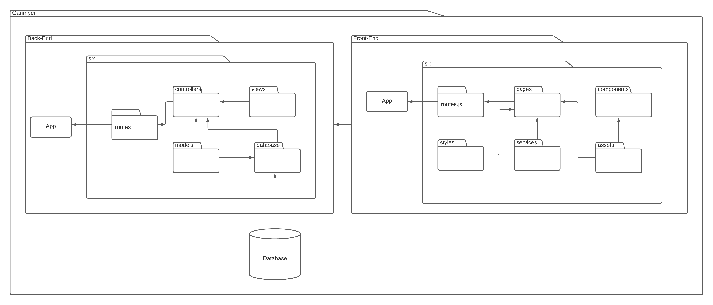

# Diagrama de Pacotes

## 1. Histórico de versão

| Versão | Data       | Descrição                                           | Autor        |
| ------ | ---------- | --------------------------------------------------- | ------------ |
| 0.1    | 17/02/2022 | Criação do documento e adição do diagrama de pacotes | Thiago Mesquita |

## 2. Introdução

&emsp;&emsp;Diagrama de Pacotes é um diagrama de estrutura UML (Unified Modeling Language), que mostra a estrutura do sistema no nível de pacotes, ou seja, o Diagrama de Pacotes tem como objetivo organizar visualmente a arquitetura do sistema em camadas para melhor entendimento da estrutura do projeto. 
Segundo Craig Lerman (2000, p. 216) no livro "Utilizando UML e padrões, diagramas de pacotes UML são utilizados frequentemente para ilustração da arquitetura lógica de um sistema - as camadas, subsistemas e outros. Além disso, Lerman também cita que um diagrama de pacotes UML fornece um modo de agrupar elementos, ou seja, pode agrupar qualquer coisa como classes, outros pacotes, casos de uso e outros. "Pacote UML é um conceito mais geral do que simplesmente um pacote Java ou espaço de nomes .NET, assim, um pacote UML pode representar esses - e muitos outros" (LARMAN, Craig. 2000, p. 216).

&emsp;&emsp;O objetivo deste documento é representar a arquitetura do projeto Garimpei utilizando o diagrama de pacotes, de forma a representar a estrutura computacional da aplicação, descrevendo os componentes de software, suas interfaces e dependências.

## 3. Diagrama de Pacotes

<figcaption>Imagem 1: Diagrama de Pacotes.</figcaption>
<figcaption>Autor: Thiago Mesquita</figcaption>

## 4. Referências
> [1] SERRANO, Milene. Arquitetura e desenho de software - 05g - VideoAula - DSW - Modelagem - Diagrama de Pacotes. Acesso em 18 de Fevereiro de 2022.

> [2] Tudo sobre diagramas de pacotes UML. Disponível em: <https://www.lucidchart.com/pages/pt/diagrama-de-pacotes-uml>. Acesso em: 18 de Fevereiro de 2022.

> [3] LARMAN, Craig. Utilizando UML e padrões. Bookman Editora, 2000. Disponível em: <https://integrada.minhabiblioteca.com.br/books/9788577800476>. Acesso em 21 de fevereiro de 2022.

