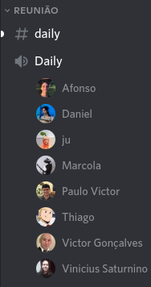
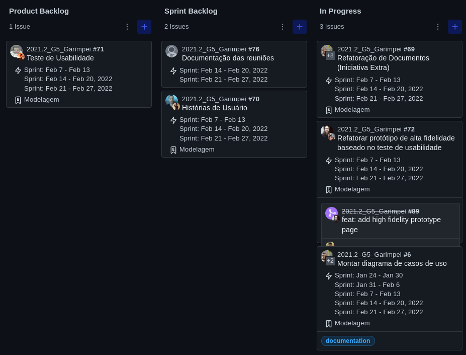

# Ata da reunião do dia 09/02 - Reunião de Planning

## 1. Histórico de versão

| Versão | Data       | Descrição                                           | Autor        |
| ------ | ---------- | --------------------------------------------------- | ------------ |
| 0.1    | 21/02/2022 | Criação do documento | Mateus Gomes e Matheus Afonso |

## 2. Participantes

Todos os integrantes do grupo estavam presentes nessa reunião.

## 3. Metodologia

A plataforma utilizada para realizar esta reunião foi o [Discord](https://discord.com/), aproveitando o horário da reunião de daily que foi definida no começo da primeira sprint pelo grupo.

<figcaption>Imagem 1: Reunião do grupo Garimpei na plataforma Discord.</figcaption>

## 4. Assuntos Discutidos

### 4.1 Planejamento das tarefas

Como resultado desta reunião, o grupo conseguiu atribuir as tarefas da sprint para cada integrante do grupo utilizando o kanban do projeto que utiliza a plataforma [ZenHub](https://www.zenhub.com/).

<figcaption>Imagem 2: Kanban do projeto Garimpei.</figcaption>