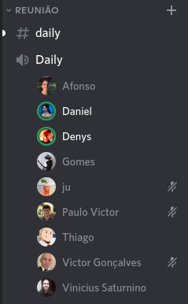
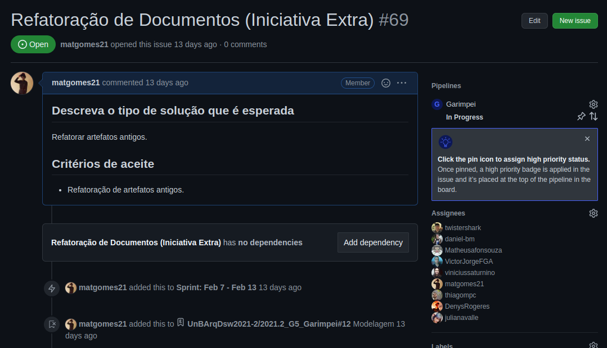

# Ata da reunião do dia 17/02 - Reunião de Feedback

## 1. Histórico de versão

| Versão | Data       | Descrição                                           | Autor        |
| ------ | ---------- | --------------------------------------------------- | ------------ |
| 0.1    | 21/02/2022 | Criação do documento | Mateus Gomes e Matheus Afonso |

## 2. Participantes

Todos os integrantes do grupo estavam presentes nessa reunião.

## 3. Metodologia

A reunião, como a maioria das reuniões do grupo, foi feita na plataforma [Discord](https://discord.com/) com um horário marcado anteriormente no [Telegram](https://web.telegram.org/) pelos integrantes do grupo.

<figcaption>Imagem 1: Reunião do grupo Garimpei na plataforma Discord.</figcaption>

## 4. Assuntos Discutidos

### 4.1 Análise do feedback da entrega anterior

Com base no feedback disponibilizado pela professora sobre a entrega anterior, os integrantes do grupo fizeram uma discussão sobre os pontos negativos e positivos apresentados neste feedback. Os pontos principais tirados desta discussão foram:

- Os artefatos precisam de um referencial teórico melhor;
- Os commits devem ser mais homogêneos;
- As discussões do grupo devem estar mais presentes nos artefatos.

### 4.2 Refatoração dos artefatos

A partir dos pontos negativos tirados do feedback, o grupo organizou um plano de ação para refatorar os artefatos já produzidos, atacando principalmente na parte do referencial teórico dos artefatos que não estão completos.

<figcaption>Imagem 2: Issue criada no kanban do projeto Garimpei para refatoração dos documentos antigos.</figcaption>