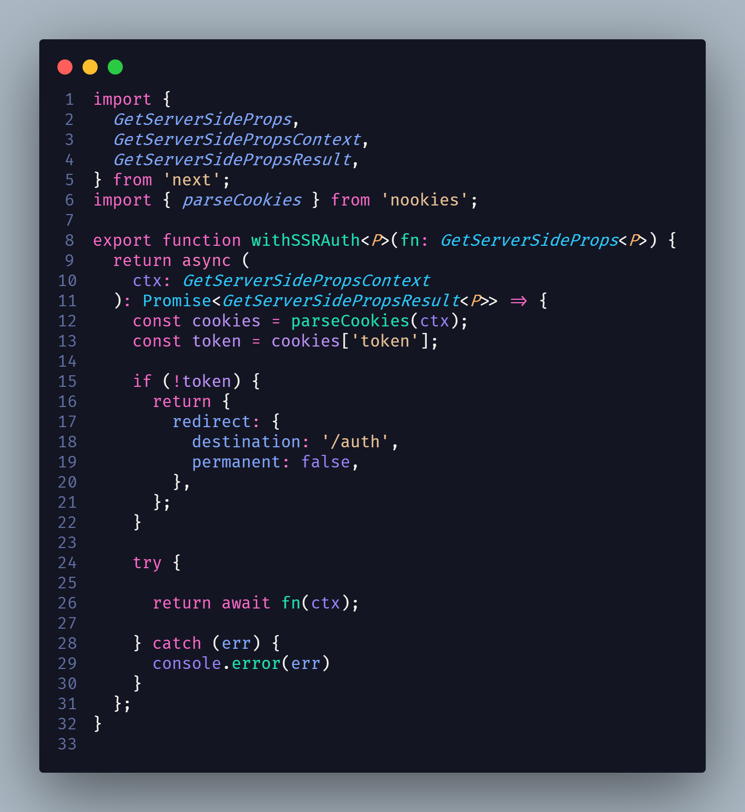

# Chain of Responsibility

## 1. Histórico de versão

| Versão | Data       | Descrição            | Autor        |
| ------ | ---------- | -------------------- | ------------ |
| 0.1    | 19/03/2022 | Criação do documento | Paulo Victor |

## 2. Definição

&emsp;&emsp;O padrão **Chain of Responsibility** nos permite passarmos pedidos por handlers. Ao receber um pedido, cada handler decide se processa o pedido ou o passa adiante para o próximo handler na corrente.

## 3. Aplicação

&emsp;&emsp;Estamos utilizando o Chain of Responsibility para garantirmos que o usuário que está tentando acessar uma tela privada, realmente esteja autenticado para conseguir esse acesso. Caso o usuário não esteja autenticado, redirecionamos o mesmo para a tela de login da aplicação. O código responsável pela verificação do estado de autenticação do usuário é um exemplo de handler da nossa aplicação.

No exemplo acima, criamos um handler responsável por verificar se o token de autenticação está presente no cookies do navegador do usuário. Esse handler é construído usando um aspecto do paradigma funcional no qual ele é uma função cujo o retorno da mesma é a execução de outra função que é passada como parâmetro. Caso o token não seja encontrado, redirecionamos o usuário para a tela de autenticação.

## 4. Referências

> [1] Chain of Responsibility. Disponível em:
> [https://refactoring.guru/pt-br/design-patterns/chain-of-responsibility](https://refactoring.guru/pt-br/design-patterns/chain-of-responsibility). Data de acesso: 19/03/2022

> [2] JavaScript Chain of Responsibility. Disponível em:
> [https://www.dofactory.com/javascript/design-patterns/chain-of-responsibility](https://www.dofactory.com/javascript/design-patterns/chain-of-responsibility). Data de acesso: 19/03/2022
