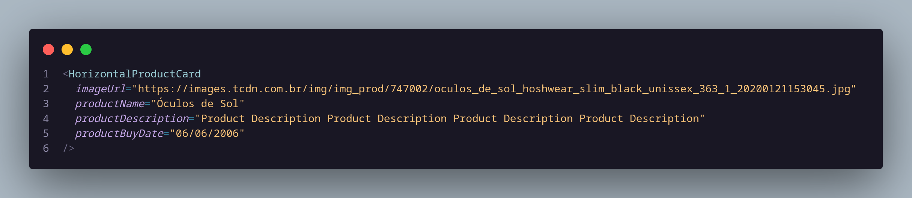

# Multiton

## 1. Histórico de versão

| Versão | Data       | Descrição            | Autor        |
| ------ | ---------- | -------------------- | ------------ |
| 0.1    | 20/03/2022 | Criação do documento | Daniel Barcelos, Thiago Mesquita e Vinicius Saturnino|

## 2. Definição

&emsp;&emsp;O padrão **Multiton** é um padrão de projeto criacional e é uma extensão do Singleton. Ele permite instanciar um número limitado de objetos de uma classe.

## 3. Aplicação

&emsp;&emsp;O Multiton foi utilizado no FrontEnd com o objetivo de utilizar os componentes do React, tornando possível instanciar diversos componentes iguais com informações distintas.

<figcaption>Imagem 1: Exemplo do padrão Multiton</figcaption>

## 4. Referências

> [1] Multiton Pattern. Disponível em:
> [https://en.wikipedia.org/wiki/Multiton_pattern](https://en.wikipedia.org/wiki/Multiton_pattern). Data de acesso: 20/03/2022

> [2] Multiton. Disponível em:
> [https://java-design-patterns.com/patterns/multiton/y](https://java-design-patterns.com/patterns/multiton/). Data de acesso: 20/03/2022

> [3] Multiton Design Pattern. Disponível em:
> [http://www.blackwasp.co.uk/multiton.aspx](http://www.blackwasp.co.uk/multiton.aspx). Data de acesso: 20/03/2022
