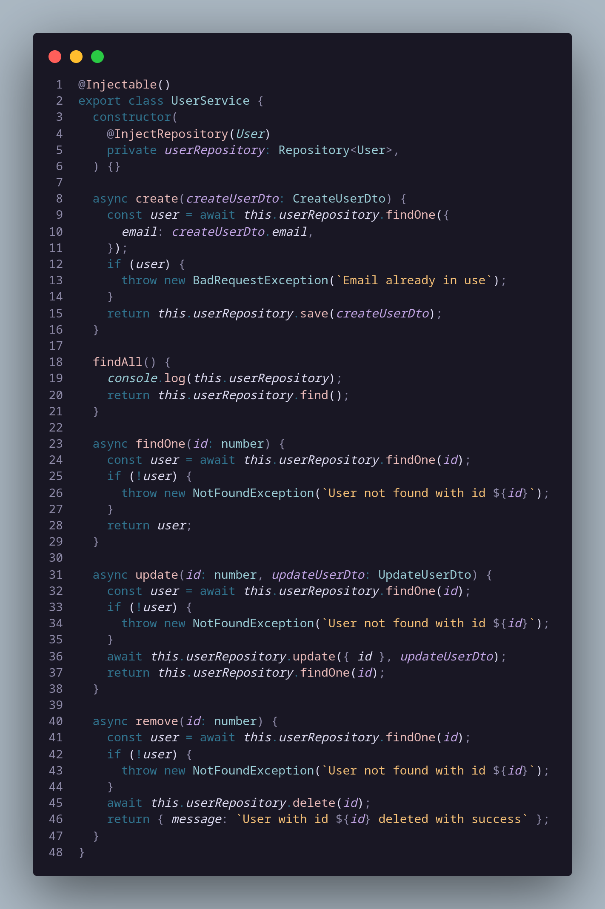

# Singleton

## 1. Histórico de versão

| Versão | Data       | Descrição            | Autor        |
| ------ | ---------- | -------------------- | ------------ |
| 0.1    | 20/03/2022 | Criação do documento | Daniel Barcelos, Thiago Mesquita e Vinicius Saturnino|

## 2. Definição

&emsp;&emsp;O padrão **Singleton** é um padrão de projeto criacional, o qual garante que uma classe tenha apenas uma instância, enquanto provê um ponto de acesso global para essa instância.

## 3. Aplicação

&emsp;&emsp;Um exemplo da aplicação de Singleton foi no BackEnd. A sua implementação seguiu o seu padrão característico descrito na documentação do NestJs, utilizando o decorator `@Injectable()` com o escopo padrão, de forma que uma única instância do provider é compartilhada por toda a aplicação.

<figcaption>Imagem 1: Exemplo do padrão Singleton</figcaption>

## 4. Referências

> [1] Injection scopes. Disponível em:
> [https://docs.nestjs.com/fundamentals/injection-scopes](https://docs.nestjs.com/fundamentals/injection-scopes). Data de acesso: 20/03/2022

> [2] Singleton. Disponível em:
> [https://refactoring.guru/pt-br/design-patterns/singleton](https://www.dofactory.com/javascript/design-patterns/chain-of-responsibility). Data de acesso: 20/03/2022

> [3] Design Patterns – Singleton - Parte 3. Disponível em:
> [https://www.devmedia.com.br/design-patterns-singleton-parte-3/16782](https://www.devmedia.com.br/design-patterns-singleton-parte-3/16782). Data de acesso: 20/03/2022
