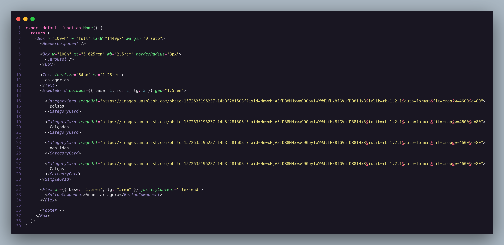
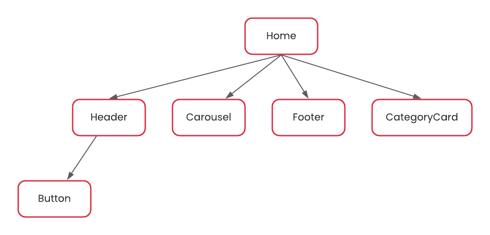

# Decorator

## 1. Histórico de versão

 
| Versão | Data       | Descrição            | Autor        |
| ------ | ---------- | -------------------- | ------------ |
| 0.1    | 20/03/2022 | Criação do documento | Juliana Valle |
 

 
## 2. Definição
O padrão **Composite** é um **padrão de projeto estrutural** que possibilita o usuário agrupar componentes para formar componentes maiores, que por sua vez podem ser agrupados para formar componentes ainda maiores. GAMMA, Erich et al. define Composite como "Composição de objetos em estruturas de árvore para representar hierarquias parte-todo. Composite permite que os clientes tratem objetos individuais e composições de objetos de maneira uniforme" (p. 163. 1995).

Todavia, o problema dessa abordagem é que o código que usa essas classes deve tratar objetos primitivos e objetos de contêiner de maneira diferente, mesmo que, na maioria das vezes, o usuário os trate da mesma forma. Ter que diferenciar entre esses objetos dificulta a aplicação. O padrão Composite descreve **como usar a composição recursiva para que o cliente não precise fazer essa distinção**.

Para a resolução desse problema, GAMMA, Erich et al. propoẽm que "**A chave para o padrão Composite é uma classe abstrata que representa tanto as primitivas quanto seus contêineres**. Para o sistema gráfico, esta classe é Graphic. Graphic declara operações como Draw que são específicas para objetos gráficos. Ele também declara operações que todos os objetos compostos compartilham, como operações para acessar e gerenciar seus filhos."

## 3. Aplicação

O **React**, que é a tecnologia por trás do Frontend da nossa aplicação, utiliza o padrão **Composite para construir interfaces de usuário**. Cada view é representada como um componente e um componente pode ser composto por vários componentes. O uso de componentes é preferível porque torna-se mais fácil desenvolver e dimensionar aplicativos que usam vários objetos menores, em vez de utilizar objetos únicos. Um exemplo dessa implementação no nosso frontend é a seguinte:

<figcaption>Imagem 1: Exemplo do padrão Composite</figcaption>

Nessa imagem, conseguimos perceber uma das aplicações de Composite que usamos na nossa aplicação frontend. A página Home é uma página **componente** na qual aloca os componentes **Header, Carousel, CategoryCard e Footer**. A representação de árvore dessa página seria da seguinte forma:

<figcaption>Imagem 2: Representação de árvore da página Home</figcaption>

## 4. Referências

> [1] Composite. Disponível em: [https://refactoring.guru/pt-br/design-patterns/composite](https://refactoring.guru/pt-br/design-patterns/composite). Acesso em 20 de Março de 2022.

> [2] SERRANO, Milene. Arquitetura e desenho de software - 09c - Vídeo-Aula - DSW - GoFs - Estruturais - Composite. Acesso em 20 de Março de 2022.

> [3] Custom route decorators. Disponível em: [https://medium.com/xp-inc/desing-patterns-parte-10-composite-f7600cb3aad7](https://medium.com/xp-inc/desing-patterns-parte-10-composite-f7600cb3aad7). Acesso em 20 de Março de 2022.

> [4] GAMMA, Erich et al. Design patterns: elements of reusable object-oriented software. Pearson Deutschland GmbH, 1995. Acesso em 20 de Março de 2022.

> [5] GUIDE TO USING THE COMPOSITE PATTERN WITH JAVASCRIPT. Disponível em: [https://x-team.com/blog/understanding-the-composite-pattern/](https://x-team.com/blog/understanding-the-composite-pattern/). Acesso em 20 de Março de 2022.
