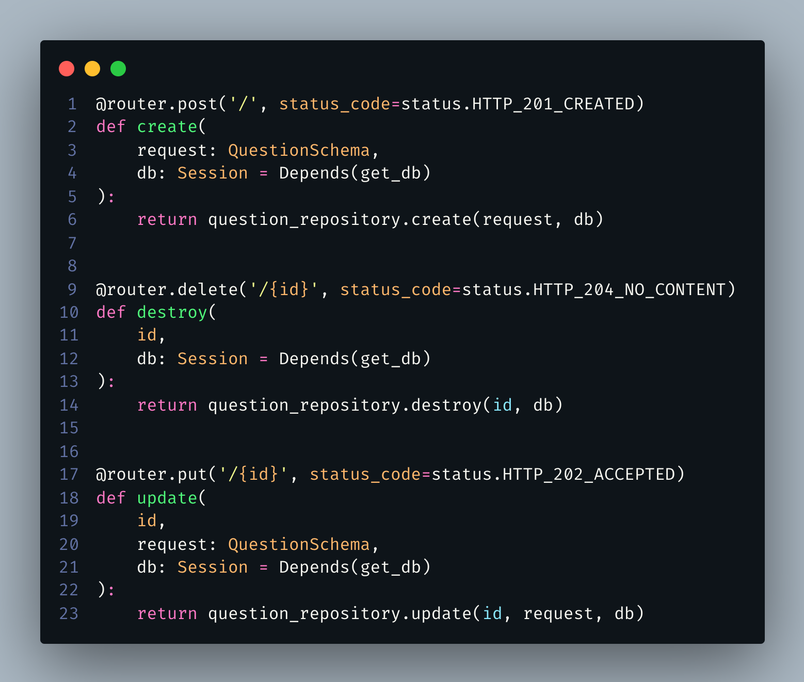

# Decorator
 
## 1. Histórico de versão
 

 
| Versão | Data       | Descrição            | Autor        |
| ------ | ---------- | -------------------- | ------------ |
| 0.1    | 20/03/2022 | Criação do documento | Matheus Afonso |
| 0.2    | 20/03/2022 | Revisão do documento | Vinicius Saturnino |
 

 
## 2. Definição
 
&emsp;&emsp;O decorator é um **padrão de projeto estrutural** que permite que você acople novos comportamentos para objetos ao colocá-los dentro de **invólucros de objetos** que contém os comportamentos desejados. Vestir roupas é um exemplo de usar decoradores. Quando você está com frio, você se envolve com um suéter. Se você ainda sente frio com um suéter, você pode vestir um casaco por cima. Se está chovendo, você pode colocar uma capa de chuva. Todas essas vestimentas “estendem” seu comportamento básico mas não são parte de você, e você pode facilmente remover uma peça de roupa sempre que não precisar mais dela.
 

## 3. Aplicação
 
Nos nossos serviços backend, os quais utilizam os frameworks **FastAPI** e **NestJS** para prover um servidor **HTTP**, implementam esse padrão de projeto para expor rotas de comunicação e definir tipos de entidades para as classes elaboradas.
 

 
Nesta imagem, podemos perceber que através do decorator definimos qual protocolo **HTTP** e rota serão utilizados para executar a funcionalidade implementada dentro do servidor, assim, facilitando o processo de definição.
 

 
Nessa imagem, podemos perceber que através da utilização do decorator **Entity** nós podemos definir que uma classe é a implementação de uma entidade dentro do **ORM** escolhido, abstraindo a etapa de definição dessas regras e assim, importando-se apenas com a definição dos campos e tipos.
 
## 4. Referências
 
> [1] Decorator. Disponível em:
> [https://refactoring.guru/pt-br/design-patterns/decorator](https://refactoring.guru/pt-br/design-patterns/decorator). Data de acesso: 20/03/2022
 
> [2] Dependencies in path operation decorators. Disponível em:
> [https://fastapi.tiangolo.com/tutorial/dependencies/dependencies-in-path-operation-decorators/](https://fastapi.tiangolo.com/tutorial/dependencies/dependencies-in-path-operation-decorators/). Data de acesso: 20/03/2022
 
> [3] Custom route decorators. Disponível em: [https://docs.nestjs.com/custom-decorators](https://docs.nestjs.com/custom-decorators). Data de acesso: 20/03/2022