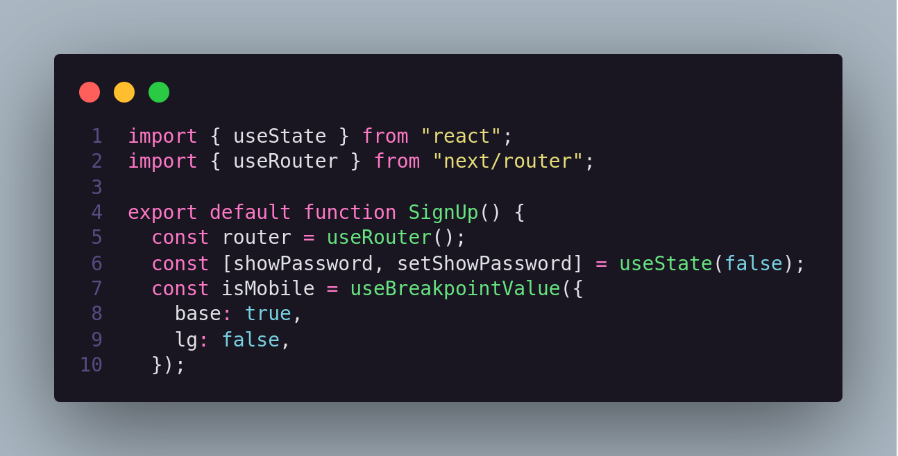

# Facade

## 1. Histórico de versão

 
| Versão | Data       | Descrição            | Autor        |
| ------ | ---------- | -------------------- | ------------ |
| 0.1    | 21/03/2022 | Criação do documento | Juliana Valle e Mateus Gomes|
 

 
## 2. Definição
O padrão **Facade** é um **padrão de projeto estrutural** que fornece uma interface simplificada para uma biblioteca, um framework, ou qualquer conjunto complexo de classes. GAMMA, Erich et al.(p. 185. 1995) define Facade como "Facade fornece uma interface unificada para um conjunto de interfaces em um subsistema. Facade define uma interface de nível superior que torna o subsistema mais fácil de usar".

Além disso, GAMMA, Erich et al. (p. 185. 1995) descreve que o padrão Facade poode ser utilizado quando "**você deseja fornecer uma interface simples para um subsistema complexo**. Os subsistemas geralmente ficam mais complexos à medida que evoluem. A maioria dos padrões, quando aplicados, resulta em classes maiores. Isso torna o subsistema mais reutilizável e mais fácil de personalizar, mas também se torna mais difícil de usar para clientes que não precisam personalizá-lo. **Facade pode fornecer uma visualização padrão simples do subsistema que é boa o suficiente para a maioria dos clientes**. Apenas os clientes que precisam de mais personalização precisarão olhar além da Facade".

## 3. Aplicação

O **React**, que é a tecnologia por trás do frontend da nossa aplicação, **implementa esse padrão de Facade através de um Hooks**. Hooks são funções que permitem a você “ligar-se” aos recursos de state e ciclo de vida do React a partir de componentes funcionais. Hooks não funcionam dentro de classes — eles permitem que você use React sem classes. React fornece alguns Hooks internos como [useState](../comportamentais/state.md). Você também pode criar os seus próprios Hooks para reutilizar o comportamento de state entre componentes diferentes. Um exemplo de utilização de Hooks em nosso código é:

<figcaption>Imagem 1: Representação da utilização de Hooks</figcaption>

Nessa imagem, estão sendo utilizados dois Hooks diferentes:

- [useState](../comportamentais/state.md)
- e useRouter

Neste exemplo, **é possível identificar a variável router que instancia o hook useRouter do Next**, que nada mais é que uma interface que simplifica a navegação na aplicação. Um exemplo de uso dessa interface é com o **método `router.push`, que permite a navegação entre telas**.

## 4. Referências

> [1] Facade. Disponível em: [https://refactoring.guru/pt-br/design-patterns/facade](https://refactoring.guru/pt-br/design-patterns/facade). Acesso em 21 de Março de 2022.

> [2] SERRANO, Milene. Arquitetura e desenho de software - 09a - Vídeo-Aula - DSW - GoFs - Estruturais. Acesso em 21 de Março de 2022.

> [3] GAMMA, Erich et al. Design patterns: elements of reusable object-oriented software. Pearson Deutschland GmbH, 1995. Acesso em 21 de Março de 2022.

> [4] GUIDE TO USING THE COMPOSITE PATTERN WITH JAVASCRIPT. Disponível em: [https://wanago.io/2019/12/09/javascript-design-patterns-facade-react-hooks/](https://wanago.io/2019/12/09/javascript-design-patterns-facade-react-hooks/). Acesso em 21 de Março de 2022.

> [5] Hooks de forma resumida. Disponível em: [https://pt-br.reactjs.org/docs/hooks-overview.html](https://pt-br.reactjs.org/docs/hooks-overview.html). Acesso em 21 de Março de 2022.
