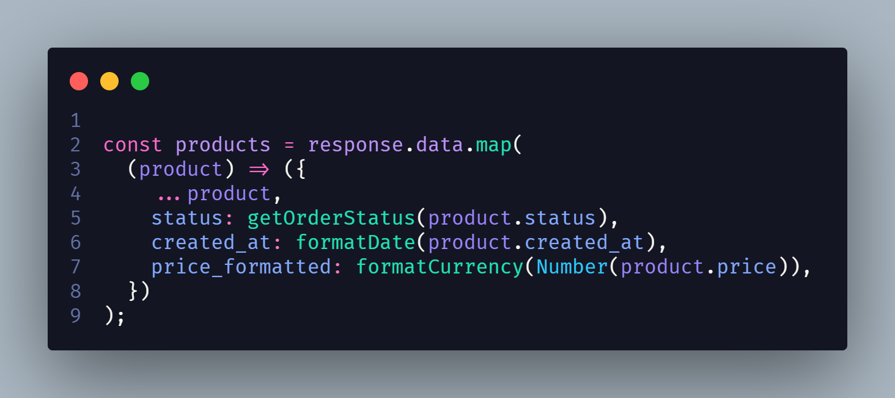

# Iterator

## 1. Histórico de versão

| Versão | Data       | Descrição            | Autor        |
| ------ | ---------- | -------------------- | ------------ |
| 0.1    | 19/03/2022 | Criação do documento | Paulo Victor |

## 2. Definição

&emsp;&emsp;O padrão **Iterator** permite com que consigamos percorrer e acessar elementos de um array/lista de forma eficiente. Esse padrão separa o array/lista da lógica de travessia deles. Com isso, conseguimos realizar essa travessia de forma muito flexível e eficiente.

## 3. Aplicação

&emsp;&emsp;O JavaScript tem **Iterators** presentes de forma padrão dentro da linguagem. Alguns desses são: **for**, **for-in**, **while**, **do while** e **map**. A utilização desse padrão nos permite reduzir repetição de código para acessar os elementos de um array e mantermos um código mais limpo e de fácil manutenção.

Nessa imagem acima temos um exemplo de aplicação de iterator que é utilizada em nosso projeto no frontend. Através do iterator **map**, conseguimos realizar a travessia de todos os objetos presentes dentro de **response.data** , que é um array, e para cada objeto conseguimos formatar alguns campos para facilitar a sua utilização posteriormente ou adicionar novos campos a cada objeto baseado em alguma informação dele ou não.

## 4. Referências

> [1] Listas e Chaves. Disponível em:
> [https://pt-br.reactjs.org/docs/lists-and-keys.html#rendering-multiple-components](https://pt-br.reactjs.org/docs/lists-and-keys.html#rendering-multiple-components). Data de acesso: 19/03/2022

> [2] Iterator. Disponível em:
> [https://refactoring.guru/pt-br/design-patterns/iterator](https://refactoring.guru/pt-br/design-patterns/iterator). Data de acesso: 19/03/2022

> [3] JavaScript Iterator. Disponível em: [https://www.dofactory.com/javascript/design-patterns/iterator](https://www.dofactory.com/javascript/design-patterns/iterator). Data de acesso: 19/03/2022
