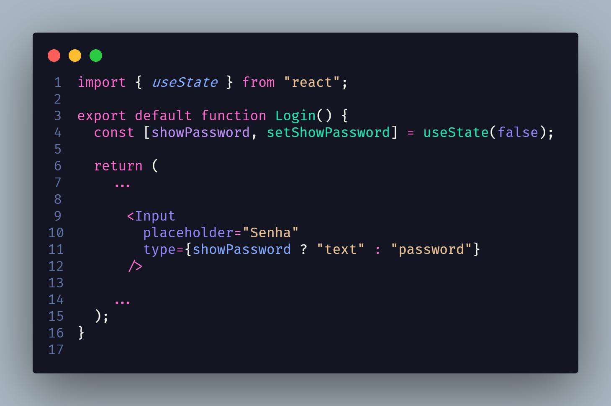

# State

## 1. Histórico de versão

| Versão | Data       | Descrição            | Autor        |
| ------ | ---------- | -------------------- | ------------ |
| 0.1    | 19/03/2022 | Criação do documento | Paulo Victor |

## 2. Definição

&emsp;&emsp;O state é um padrão de projeto que permite que um **objeto altere seu comportamente quando seu estado interno muda**. Podemos pensar no estado como uma **máquina de estado**, na qual dependendo do estado, a saída gerada é diferente. Podemos imaginar, no escopo do frontend, como o estado aplicado em um botão. Podemos ter um estado informando se aquele botão deve apresentar a mensagem "Enviar" ou se ele deve mostrar "Enviando...". O que decide qual mensagem deve ser mostrada seria o estado. O **benefício** de utilizarmos esse padrão é **isolarmos lógicas de estado** dentro de pedaços pequenos de código que funcionam de forma independente. Assim, não precisamos colocar todas as lógicas de estados dentro de um componente pai. Ao contrário, isolamos dentro de cada filho o estado, caso seja necessário.

## 3. Aplicação

&emsp;&emsp;O **React**, que é a tecnologia por trás do frontend da nossa aplicação, implementa esse padrão de estado através de um hook chamado useState. O **useState** é uma função cujo o retorno é um array/lista contendo na primeira posição o valor atual do estado e na segunda posição uma função para atualização desse estado. Essa função para atualizar o estado se faz necessário devido aos conceitos de imutabilidade presentes no React e que também se faz presentes em outros frameworks frontend. Um exemplo dessa implementação no nosso frontend é a seguinte:

Nessa imagem, conseguimos perceber uma das aplicações de estado que usamos na nossa aplicação frontend. Através do estado conseguimos trocar o type do elemento input do HTML de forma a mostrar o seu valor de forma oculta como password ou como texto. Isso foi aplicado para os campos onde o usuário pode digitar sua senha e permitir que ele possa visualizar a senha digitada.

## 4. Referências

> [1] State. Disponível em:
> [https://refactoring.guru/pt-br/design-patterns/state](https://refactoring.guru/pt-br/design-patterns/state). Data de acesso: 19/03/2022

> [2] JavaScript State. Disponível em:
> [https://www.dofactory.com/javascript/design-patterns/state](https://www.dofactory.com/javascript/design-patterns/state). Data de acesso: 19/03/2022

> [3] Estado e Ciclo de Vida. Disponível em: [https://pt-br.reactjs.org/docs/state-and-lifecycle.html](https://pt-br.reactjs.org/docs/state-and-lifecycle.html). Data de acesso: 19/03/2022
