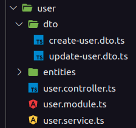
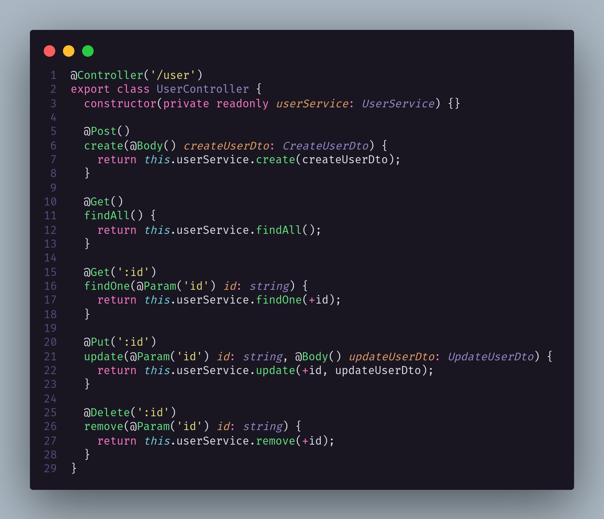
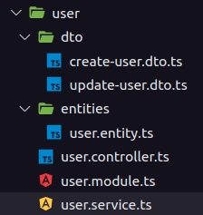
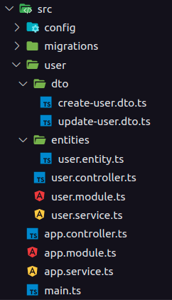

# GRASPs

## 1. Histórico de versão

| Versão | Data       | Descrição                   | Autor         |
| ------ | ---------- | --------------------------- | ------------- |
| 0.1    | 21/03/2022 | Criação do documento        | Mateus Gomes  |
| 0.2    | 21/03/2022 | Correção no alt das imagens | Mateus Gomes  |
| 0.3    | 21/03/2022 | Revisão do documento        | Juliana Valle |

## 2. Definição

GRASP é uma sigla para _General Responsability Assignment Software Patterns_, que pode ser traduzido para Padrões de Software para Atribuições de Responsabilidade Geral. De acordo com Larman (2005, p. 220), os padrões GRASP definem princípios fundamentais para o design orientado a objetos e atribuição de responsabilidades, expressados como padrões de projeto.

Os padrões GRASP são um auxiliar de aprendizagem para ajudar a entender o essencial do design orientado a objeto e aplicar o raciocínio do design de uma maneira metódica, racional e explicável (Larman, 2005 p. 216). Os padrões GRASP, quando seguidos, fornecem uma boa estrutura para as aplicações e habilitam a fácil adaptação diante da necessidade de mudanças (DevMedia).

A consequência direta das recomendações propostas pelos GRASPs é um código melhor organizado, de fácil manutenção e ainda, capaz de ser compreendido por diferentes desenvolvedores sem grandes dificuldades (DevMedia). Os GRASPs são descritos pelos seguintes tópicos:

- GRASP Criador;
- GRASP Especialista;
- GRASP da Alta Coesão;
- GRASP do Baixo Acoplamento;
- GRASP Controlador;
- GRASP do Polimorfismo;
- GRASP da Invenção Pura;
- GRASP da Indireção;
- GRASP de Variações Protegidas.

Neste artefato, serão abordados os tópicos **Controlador**, **Especialista** e **Alta Coesão e Baixo Acoplamento**, abordando suas respectivas definição e como estes princípios foram utilizados no desenvolvimento do projeto Garimpei.

## 3. Controlador

### 3.1 Definição

O GRASP Controlador define que deve haver um componente específico, dentro do paradigma da Orientação a Objetos, que é responsável por lidar com as requisições dos atores do sistema. O Controlador sabe interpretar as ações da interface de usuário, e como conectar estas ações com os comportamentos do sistema, ou seja, o Controlador é a ponte entre a interface (_Front-End_) e o servidor (_Back-End_) da aplicação (Koopmans, 2017). O Controlador é um dos pilares da arquitetura MVC (_Model-View-Controller_), sendo muito importante para os frameworks modernos de desenvolvimento web.

### 3.2 Utilização

Dentro do _framework_ **Nest.js**, os Controladores são responsáveis por lidar com as _requests_ recebidas e devolver _responses_ para o _client_, sendo uma estrutura essencial para a construção de APIs com este _framework_. Os Controladores fazem parte da estrutura das entidades do sistema em **Nest.js**, mapeando as rotas destas entidades.

<figcaption>Imagem 1: Estrutura da entidade de usuários do sistema de autenticação do projeto Garimpei.</figcaption>

Na imagem acima, é possível observar a estrutura da entidade de usuário do sistema de autenticação do projeto Garimpei, que utiliza o _framework_ **Nest.js**. Nesta estrutura, existe o arquivo `user.controller.ts`, que define o Controlador para essa entidade, que nada mais é que uma classe mapeando as requisições relacionadas à entidade de usuários.

<figcaption>Imagem 2: Trecho do código do Controlador da entidade de Usuários.</figcaption>

O arquivo `user.controller.ts` implementa a classe `UserController`, que é justamente o Controlador da entidade de usuários. Esta classe possui funções nas quais mapeiam as requisições disponíveis para esta entidade, como é o caso da função `findAll()`, que é mapeada para ser a requisição com o método `GET`, que chama o serviço responsável por encontrar e devolver todos os usuários cadastrados dentro do sistema.

## 4. Especialista

### 4.1 Definição

O GRASP Especialista define que deve haver um encapsulamento das informações a respeito de uma tarefa em uma classe específica. Este padrão é semelhante a um especialista no mundo real, ou seja, é possível existir uma mesma classe respnsável por executar várias tarefas diferentes, mas classes especialistas trazem as ferramentas ideais para executar a tarefa de sua responsabilidade (Koopmans, 2017).

### 4.2 Utilização

Dentro da [API de autenticação do projeto Garimpei](https://github.com/UnBArqDsw2021-2/2021.2_G5_Garimpei_Auth), é possível observar o padrão GRASP Especialista na estrutura do projeto.

Como pode ser visto na imagem acima, a entidade de usuário é dividida em alguns arquivos, sendo que cada arquivo possui uma responsabilidade específica, sendo elas:

<figcaption>Imagem 3: Estrutura de arquivos da entidade de usuários do sistema de autenticação do projeto Garimpei.</figcaption>

- `dtos`: os arquivos dtos servem para descrever os tipos de dados esperados por determinada classe;
- `user.entity.ts`: este arquivo é responsável por modelar a entidade de usuário no banco de dados, definindo as colunas e relacionamentos da mesma;
- `user.controller.ts`: este arquivo é responsável por ser o componente Controlador da entidade de usuário, mapeando as requisições da mesma;
- `user.module.ts`: este arquivo é responsável por guardar as configurações da entidade;
- `user.service.ts`: este arquivo é responsável por implementar os serviços da entidade de usuário, implementando as funcionalidades e regras de negócio necessárias para as requisições que são mapeadas pelo componente Controlador.

## 5. Alta Coesão e Baixo Acoplamento

### 5.1 Definição

Larman (2005) define acoplamento como uma métrica que mede a força das conexões de um código, ou seja, o quão dependente a camada de conhecer está entre os diversos componentes do sistema. Sabendo disso, o padrão GRASP Baixo Acoplamento define um modelo de implementação que visa:

- Menor dependência entre as classes;
- Menor impacto por mudanças em classes existentes;
- Maior potencial de reutilização de código.

O padrão GRASP Alta Coesão vem para complementar o príncipio do baixo acoplamento, trazendo padrões para a camada de responsabilidades de cada componente do sistema, sendo possível determinar o nível de conexão entre os diferentes elementos do sistema.

### 5.2 Utilização

O _framework_ **Nest.js** define padrões em sua utilização, principalmente ao utilizar sua interface (CLI) na hora de construir os recursos da aplicação. Na implementação da [API de autenticação do projeto Garimpei](https://github.com/UnBArqDsw2021-2/2021.2_G5_Garimpei_Auth), esta interface foi utilizada para gerar todos os recursos da aplicação, como pode ser observado na imagem abaixo.

<figcaption>Imagem 4: Estrutura de arquivos da API de autenticação do projeto Garimpei.</figcaption>

Ao utilizar estes padrões ja estabelecidos pelo **Nest.js**, a implementação já segue práticas de Alta Coesão e Baixo Acomplamento, dando uma própria responsabilidade para cada componente do projeto e proporcionando um nível adequado de acoplamento entre os elementos do sistema.

## 6. Conclusão

Após conhecer e implementar os padrões de software estabelecidos pelo GRASP no projeto Garimpei, notou-se que o sistema ficou muito amigável para entender a responsabilidade de cada componente e a implementação possui um bom suporte para mudanças e para novas features, colaborando muito com a produtividade do grupo, e principalmente, para a qualidade do código e da aplicação.

## 7. Referências

> [1] Larman, C. 2005. Applying UML and Patterns – An Introduction to Object-Oriented Analysis and Design and Iterative Development 3rd ed. New Jersey.

> [2] Desenvolvimento com qualidade com GRASP. **DevMedia**. Disponível em <https://www.devmedia.com.br/desenvolvimento-com-qualidade-com-grasp/28704>. Acesso em: 21 de março de 2022.

> [3] KOOPSMANS, Regan. Understanding the GRASP Design Patterns. **Medium**, 2017. Disponível em <https://medium.com/@ReganKoopmans/understanding-the-grasp-design-patterns-2cab23c7226e>. Acesso em: 21 de março de 2022.

> [4] SERRANO, Milene. Arquitetura e Desenho de Software AULA – GRASP – PARTE I. 36 slides.

> [5] SERRANO, Milene. Arquitetura e Desenho de Software AULA – GRASP_A - COMPLEMENTAR – PARTE I. 66 slides.
