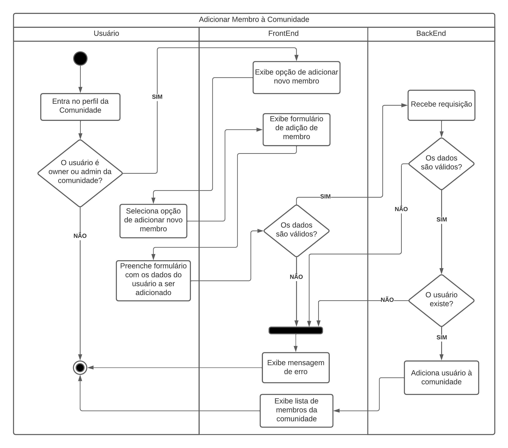

# Documento de Arquitetura de Software

## 1. Histórico de versão

| Versão | Data       | Descrição                   | Autor         |
| ------ | ---------- | --------------------------- | ------------- |
| 0.1    | 17/04/2022 | Criação do documento        | Daniel Barcelos e Matheus Afonso  |
| 0.2    | 17/04/2022 | Criação da visão de casos de usos | Denys Rógeres e Victor Gonçalves  |
| 0.3    | 17/04/2022 | Escrita da visão de casos de usos | Denys Rógeres e Victor Gonçalves  |
| 0.4    | 18/04/2022 | Escrita da visão de processos| Thiago Mesquita e Vinícius Saturnino  |
| 0.5    | 18/04/2022 | Inserção da visão lógica | Daniel Barcelos e Paulo Victor  |
| 0.6    | 18/04/2022 | Inserção da visão de implantação | Thiago Mesquita e Mateus Gomes  |
| 0.7    | 18/04/2022 | Adição da representação arquitetural do Back-End | Juliana Pereira e Matheus Afonso  |
| 0.8    | 18/04/2022 | Inserção da visão de implementação, tamanho, desempenho e qualidade | Daniel Barcelos, Thiago Mesquita e Mateus Gomes|
| 0.9    | 18/04/2022 | Adição da representação arquitetural do Front-End | Juliana Pereira e Paulo Victor  |
| 0.10    | 18/04/2022 | Adição da introdução, finalidade e visão geral | Juliana Pereira e Denys Rógeres  |

## 2. Introdução
Este documento é um documento de arquitetura (DAS) e possui o objetivo de descrever a arquitetura da solução de software **Garimpei**. Este sistema busca auxiliar comunidades que desejam abrir um bazar/brechó, com artigos que são doados ou mesmo confeccionados por membros da comunidade.

### 2.1 Finalidade
Este documento tem como finalidade fornecer uma visão arquitetural abrangente do sistema Garimpei, por meio de diversas visões arquiteturais para representar diferentes aspectos da aplicação. Com o propósito de demonstrar as decisões arquiteturais tomadas no desenvolvimento do Garimpei.

### 2.2 Escopo

### 2.3 Definições, Acrônimos e Abreviações

### 2.4 Visão geral
Este documento visa detalhar as soluções arquiteturais desenvolvidas no sistema. Deste modo, neste documento serão abordados os seguintes aspectos:

- Representação Arquitetural
- Restrições e Metas Arquiteturais
- Visão de Casos de Uso
- Visão Lógica
- Visão de Implantação
- Visão de Implementação
- Tamanho e Desempenho
- Qualidade

## 3. Representação Arquitetural

### 3.1 Back-End
O "**Nest (NestJS)** é uma estrutura para criar aplicativos Node.js eficientes e escaláveis ​​do lado do servidor. Ele usa JavaScript progressivo, é construído com e suporta totalmente TypeScript (ainda permite que os desenvolvedores codifiquem em JavaScript puro) e combina elementos de OOP (Programação Orientada a Objetos), FP (Programação Funcional) e FRP (Programação Reativa Funcional). O Nest fornece um nível de abstração acima dessas estruturas comuns do Node.js (Express/Fastify), mas também expõe suas APIs diretamente ao desenvolvedor. Isso dá aos desenvolvedores a liberdade de usar a infinidade de módulos de terceiros que estão disponíveis para a plataforma subjacente" [(NestJS)](https://docs.nestjs.com/).

O **FastAPI** é um framework Web para desenvolvimento de APIs RESTful em Python. FastAPI é baseado em Pydantic e dicas de tipo para validar, serializar e desserializar dados e gerar automaticamente documentos OpenAPI. Além disso, suporta programação assíncrona e suas principais caracteristicas são: "rápido, rápido para codificar, menos bugs, intuitivo, fácil, curto, robusto e baseado em padrões" [(FastAPI)](https://fastapi.tiangolo.com/).

O **Docker** é uma plataforma aberta para desenvolvimento, envio e execução de aplicativos. O Docker permite que ocorra separação de aplicativos da infraestrutura para que possa ser entregue software rapidamente. Com o Docker, pode ser feito o gerenciamento da infraestrutura da mesma forma que o gerenciamento de aplicativos. "O Docker fornece a capacidade de empacotar e executar um aplicativo em um ambiente levemente isolado chamado contêiner. O isolamento e a segurança permitem que você execute vários contêineres simultaneamente em um determinado host. Os contêineres são leves e contêm tudo o que é necessário para executar o aplicativo, portanto, você não precisa depender do que está instalado no host. Você pode compartilhar contêineres facilmente enquanto trabalha e garantir que todos com quem você compartilha obtenham o mesmo contêiner que funciona da mesma maneira" [(Docker)](https://docs.docker.com/get-started/overview/).

### 3.2 Front-End
O **Next.js** é um framework para React. O NextJS habilita recursos como renderização do lado do servidor e geração de site estático para aplicativos da Web baseados em React. É uma estrutura pronta para produção que permite que os desenvolvedores criem rapidamente sites JAMstack estáticos e dinâmicos e é amplamente utilizada por muitas grandes empresas. "O Next.js visa ter a melhor experiência de desenvolvedor da categoria e muitos recursos integrados, como:

- Um sistema de roteamento intuitivo baseado em página (com suporte para rotas dinâmicas);

- Pré-renderização , geração estática (SSG) e renderização do lado do servidor (SSR) são suportadas por página;

- Divisão automática de código para carregamentos de página mais rápidos
Roteamento do lado do cliente com pré-busca otimizada;

- Suporte integrado a CSS e Sass e suporte para qualquer biblioteca CSS-in-JS;

- Ambiente de desenvolvimento com suporte para atualização rápida;

- Rotas de API para criar endpoints de API com funções sem servidor;
- Totalmente extensível" [(NextJS)](https://nextjs.org/learn/basics/create-nextjs-app).

O "**Chakra UI** é uma biblioteca de componentes simples, modular e acessível que fornece os blocos de construção necessários para construir seus aplicativos React" [(Chakra UI)](https://chakra-ui.com/).

## 4. Metas e Restrições da Arquitetura

## 5. Visão de Casos de Uso
&emsp;&emsp;Com o intuito de realizar uma representação mais próxima do usuário, a **visão de casos de uso** retrata as interações dos atores descrevendo os diversos cenários de uso da aplicação. Para uma melhor compreensão do sistema, dividimos em quatro casos de uso que contemplam os requisitos elicitados para o desenvolvimento do sistema.

### 5.1. UC01 - Gerenciar conta

<figcaption>Imagem 1: Imagem que contém caso de uso UC01.</figcaption>

| **UC01** | **Informações** |
| --- | --- |
| Ator | Usuário (Pessoa que interage com sistema Garimpei) |
| Pré-condições | Não se aplica |
| Descrição | Este presente caso de uso visa contemplar as atividades relacionadas à gerência da conta do usuário. Dessa forma, estão descritas as atividades que vão desde o cadastro do usuário, acessar ou editar seu perfil... Entre outras atividades.|
| Rastrabilidade | Requisitos Funcionais 1, 2, 3, 4, 5, 6 e 7 do [Documento de Priorização](https://unbarqdsw2021-2.github.io/2021.2_G5_Garimpei/entrega_I/projeto_nao_orientado_a_abordagens_especificas/priorizacao/)|

### 5.2. UC02 - Realizar pedido

<figcaption>Imagem 2: Imagem que contém caso de uso UC02.</figcaption>

| **UC02** | **Informações** |
| --- | --- |
| Ator | Usuário (Pessoa que interage com sistema Garimpei) |
| Pré-condições | Estar logado (Caso de uso UC01) |
| Descrição | Este presente caso de uso visa contemplar as atividades relacionadas à realização de pedidos e suas atividades relacionadas. Dessa forma, estão representadas atividades como: busca de produto, visualizar anúncio, realizar pergunta em anúncios, favoritar anúncio... Entre outros|
| Rastrabilidade | Requisitos Funcionais 9, 10, 11, 16, 19, 21, 22, 23, 24 e 26 do [Documento de Priorização](https://unbarqdsw2021-2.github.io/2021.2_G5_Garimpei/entrega_I/projeto_nao_orientado_a_abordagens_especificas/priorizacao/)|

### 5.3. UC03 - Criar comunidade

<figcaption>Imagem 3: Imagem que contém caso de uso UC03.</figcaption>

| **UC03** | **Informações** |
| --- | --- |
| Ator | Usuário (Pessoa que interage com sistema Garimpei) |
| Pré-condições | Estar logado (Caso de uso UC01) |
| Descrição | Este presente caso de uso visa contemplar as atividades relacionadas à criação de comunidade e suas atividades relacionadas. Dessa forma, estão representadas atividades como: cadastrar comunidade, alterar informações da comunidade, cadastrar pessoas em uma comunidade... Entre outros|
| Rastrabilidade | Requisitos Funcionais 25, 27, 28, 29, 30, 31 e 32 do [Documento de Priorização](https://unbarqdsw2021-2.github.io/2021.2_G5_Garimpei/entrega_I/projeto_nao_orientado_a_abordagens_especificas/priorizacao/)|

### 5.4. UC04 - Criar anúncio

<figcaption>Imagem 4: Imagem que contém caso de uso UC04.</figcaption>

| **UC04** | **Informações** |
| --- | --- |
| Ator | Usuário (Pessoa que interage com sistema Garimpei) |
| Pré-condições | Estar logado (Caso de uso UC01) |
| Descrição | Este presente caso de uso visa contemplar as atividades relacionadas à criação de anúncios e suas atividades relacionadas. Dessa forma, estão representadas atividades como: cadastrar anúncio, editar anúncio, responder perguntas de seus anúncios, excluir anúncio... Entre outros|
| Rastrabilidade | Requisitos Funcionais 12, 13, 14, 15, 17, 18, 20 e 23 do [Documento de Priorização](https://unbarqdsw2021-2.github.io/2021.2_G5_Garimpei/entrega_I/projeto_nao_orientado_a_abordagens_especificas/priorizacao/)|

## 6. Visão Lógica

&emsp;&emsp;A visão lógica descreve como o sistema é estruturado, em termos de unidades de implementação. Os elementos são pacotes, classes e interfaces. O relacionamento entre os elementos mostra as dependências, as realizações de interface, os relacionamentos parte-todo e assim por diante.

### 6.1 Diagrama de Pacotes

<figcaption>Imagem 5: Diagrama de Pacotes.</figcaption>
<figcaption>Autor: Thiago Mesquita</figcaption>

### 6.2 Diagrama de Classes

<figcaption>Imagem 6: Diagrama de Classes.</figcaption>
<figcaption>Autores: Mateus Gomes e Matheus Afonso</figcaption>

## 7. Visão de Processos
&emsp;&emsp;A Visão de Processos descreve como o sistema de tempo-de-execução é estruturado na forma de um conjunto de elementos que têm interações e comportamento de tempo-de-execução. A estrutura de tempo-de-execução normalmente tem pouca semelhança com a estrutura de código. Consiste de redes de comutação rápida de objetos de comunicação.

### 7.1 Diagrama de Comunicação

<strong>Interação do Usuário</strong>

<figcaption>Imagem 7: Diagrama de comunicação - Usuário</figcaption>
<figcaption>Autor: Denys Rógeres</figcaption>

### 7.2 Diagramas de Atividades

<strong>Cadastro de Usuário</strong>

<figcaption>Imagem 8: Diagrama de atividades - Cadastro de Usuário.</figcaption>
<figcaption>Autor: Thiago Mesquita</figcaption>

<strong>Adicionar Usuário à Comunidade</strong>

<figcaption>Imagem 9: Diagrama de atividades - Adicionar Usuário à Comunidade.</figcaption>
<figcaption>Autor: Thiago Mesquita</figcaption>

<strong>Comprar Produto</strong>

<figcaption>Imagem 10: Diagrama de atividades - Comprar Produto.</figcaption>
<figcaption>Autor: Thiago Mesquita</figcaption>

 

<strong>Denunciar Vendedor</strong>

<figcaption>Imagem 11: Diagrama de atividades - Denunciar Vendedor.</figcaption>
<figcaption>Autor: Thiago Mesquita</figcaption>

<strong>Cadastro de Comunidade</strong>

<figcaption>Imagem 12: Diagrama de atividades - Cadastro de Comunidade.</figcaption>
<figcaption>Autor: Daniel Barcelos</figcaption>

<strong>Anunciar Produto</strong>

<figcaption>Imagem 13: Diagrama de atividades - Anunciar Produto.</figcaption>
<figcaption>Autor: Daniel Barcelos</figcaption>

<strong>Avaliar Vendedor</strong>

<figcaption>Imagem 14: Diagrama de atividades - Avaliar Vendedor.</figcaption>
<figcaption>Autor: Daniel Barcelos</figcaption>

## 8. Visão de Implantação
&emsp;&emsp;Garimpei é uma aplicação web que segue um modelo de camadas. Possui a camada do frontend, uma gateway, e o banco de dados. A camada de frontend realiza requisições para a gateway, que, por sua vez, encaminha a requisição para o backend que interage com o banco de dados e retorna a resposta à gateway, que encaminha novamente para o frontend que organiza como essa resposta será visualizada pelo usuário.

<figcaption>Imagem 15: Visão de Implantação</figcaption>
<figcaption>Autor: Thiago Mesquita</figcaption>

## 9. Visão de Implementação

&emsp;&emsp;A visão de implementação descreve como os artefatos de desenvolvimento estão organizados no sistema de arquivos. Os elementos são arquivos e diretórios (quaisquer itens de configuração). Isto inclui os artefatos de desenvolvimento e os artefatos de implantação.

<figcaption>Imagem 16: Diagrama de Componentes Garimpei.</figcaption>
<figcaption>Autores: Paulo Victor e Vinicius Saturnino</figcaption>

## 10. Tamanho e Desempenho

&emsp;&emsp;Considerando todos os repositórios do projeto, o somatório de todos é menor do que 1GB. Para acessar a aplicação, não é necessário a instalação de nenhum programa, apenas acesso a internet e um dispositivo mobile ou computador. Em relação ao desempenho da aplicação, a mesma possui uma otimização em relação as respostas de requisições, suporta usuários simultâneos e o carregamento das páginas ocorre em alguns milisegundos.

## 11. Qualidade

&emsp;&emsp;Foi utilizada a norma ISO/IEC 9126, cujo objetivo é definir um conjunto de parâmetros que visam padronizar a avaliação da qualidade de software.

| Critérios| Descrição|
|-------|---------|
|Funcionalidade| A aplicação foi construída segundo os requisitos que foram levantados no começo do projeto.|
|Confiabilidade| O sistema possui tolerância a falhas e uma boa recuperabilidade, visto que o banco de dados dos microserviços possuem um backup automático.|
|Usabilidade| O sistema possui uma interface simples, clara, intuitiva e foi construído com base no protótipo de alta fidelidade. Também segue um padrões de cores e fontes definidos no manual de identidade visual. |
|Eficiência| A aplicação suporta usuários simultâneos e possui uma otimização em relação ao tempo de respostas de requisições.|
|Manutenibilidade| Os padrões de projeto aplicados durante o desenvolvimento facilitam a identificação de defeitos, na correção e evolução do código. |
|Portabilidade| A utilização do docker garante um ambiente estável de desenvolvimento e produção, além de fornecer uma fácil instalação de dependências, configuração e execução. |

## 12. Referências
> [1] Diretriz: Visão Arquitetural. Disponível em: [https://www.trt9.jus.br/pds/pdstrt9/guidances/guidelines/architectural_view_FF6EDA37.html](https://www.trt9.jus.br/pds/pdstrt9/guidances/guidelines/architectural_view_FF6EDA37.html). Data de acesso: 18/04/2022

> [2] Qualidade de Software - Engenharia de Software 29. Disponível em: [https://www.devmedia.com.br/qualidade-de-software-engenharia-de-software-29/18209](https://www.devmedia.com.br/qualidade-de-software-engenharia-de-software-29/18209). Data de acesso: 18/04/2022

> [3] KOSCIANSKI, André; DOS SANTOS SOARES, Michel. Qualidade de Software-2ª Edição: Aprenda as metodologias e técnicas mais modernas para o desenvolvimento de software. Novatec Editora, 2007.

> [4] Documento de Arquitetura de Software. Disponível em: [https://www.cin.ufpe.br/~gta/rup-vc/core.base_rup/guidances/guidelines/software_architecture_document_F4C93435.html](https://www.cin.ufpe.br/~gta/rup-vc/core.base_rup/guidances/guidelines/software_architecture_document_F4C93435.html). Data de acesso: 18/04/2022

> [5] Diretriz: Visão Arquitetural. Disponível em: [https://www.trt9.jus.br/pds/pdstrt9/guidances/guidelines/architectural_view_FF6EDA37.html](https://www.trt9.jus.br/pds/pdstrt9/guidances/guidelines/architectural_view_FF6EDA37.html). Data de acesso: 18/04/2022
