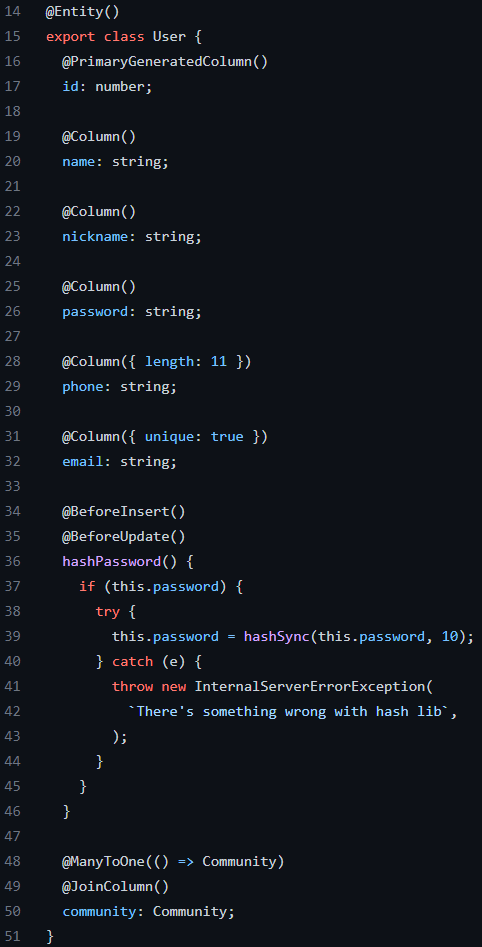
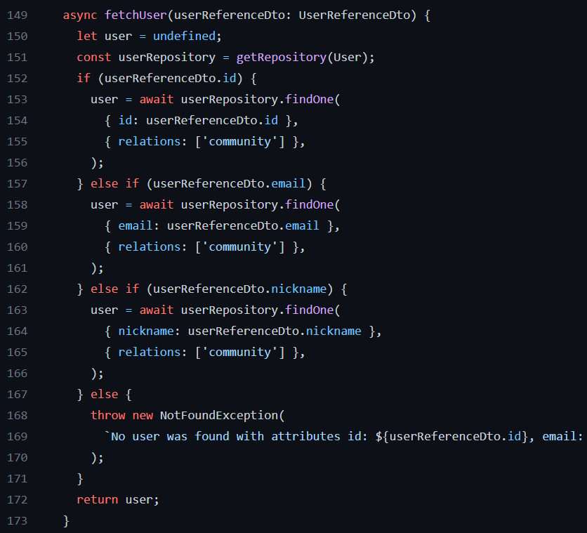
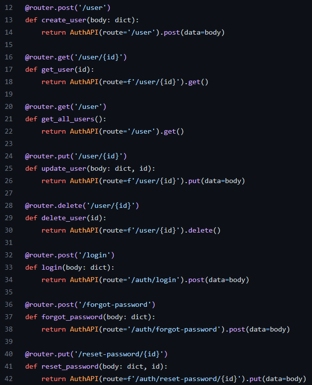

# Reutilização de Software

## 1. Histórico de versão

| Versão | Data       | Descrição                   | Autor         |
| ------ | ---------- | --------------------------- | ------------- |
| 0.1    | 17/04/2022 | Criação do documento        | Denys Rógeres e Paulo Victor  |
| 0.2    | 17/04/2022 | Escrita reutilização de Software        | Denys Rógeres e Paulo Victor  |
| 0.3   | 18/04/2022 | Adição da seção sobre back-end | Victor Jorge, Matheus Afonso, Vinicius Saturnino, Thiago Mesquita, Mateus Gomes, Daniel Barcelos e Juliana Valle |

## 2. Introdução

## 3. Reutilização no Back-End

### NestJS

O NestJS é um framework utilizado para criar aplicações NodeJS servidoras escaláveis. O NestJS utiliza JavaScript progressivo, além de suportar TypeScript [1].

De fato, o NestJS possui sua arquitetura baseada no Angular, permitindo então a criação de softwares altamente testáveis, escaláveis, poucamente acoplados e manuteníveis. Dessa forma, o  rogramador é poupado do esforço de se tomar diversas decisões, além de se permitir a reutilização de software através da modularização do código. A fim de exemplo, temos a utilização das entidades no projeto, onde declaramos um repositório para cada uma delas com uma linguagem de acesso comum, possibilitando então o reúso dessas entidades em diversos pontos do código.

<figcaption>Imagem 1: Entidade User</figcaption>
<figcaption>Fragmento de código retirado do projeto</figcaption>

<figcaption>Imagem 2: Utilização da entidade User no módulo Community</figcaption>
<figcaption>Fragmento de código retirado do projeto</figcaption>

### FastAPI

O FastAPI é um framework web moderno de alta performance para criação de APIs utilizando o Python 3.6+.

No contexto do projeto, a utilização do FastAPI se deve pela decisão arquitetural de microserviços dispostos em atômicos end-points. Dessa maneira, o server-side da aplicação foi criado como uma interface simples para permitir a reusabilidade, uma vez que um end-point não está necessariamente atrelado a uma outra funcionalidade específica. Ou seja, qualquer módulo de código poderá utilizar um end-point, desde que conheça e obedeça as regras de busca/inserção de dados.

<figcaption>Imagem 3: End-points fornecidos no back-end</figcaption>
<figcaption>Fragmento de código retirado do projeto</figcaption>

## 4. Reutilização no Front-End

Os componentes no React tem o intuito de realizar uma divisão da interface em pequenas partes independentes e reutilizáveis. Dessa forma, cada componente é tratado como um bloco individual e independente. Além disso, os componentes podem se referir a outros componentes em sua saída. Isso nos permite usar a mesma abstração de componente para qualquer nível de detalhe.

## 5. Bibliografia

[1] CimpleO. NestJS modules Design. Disponível em https://cimpleo.com/blog/nestjs-modules-design/. Último acesso em 18/04/2022