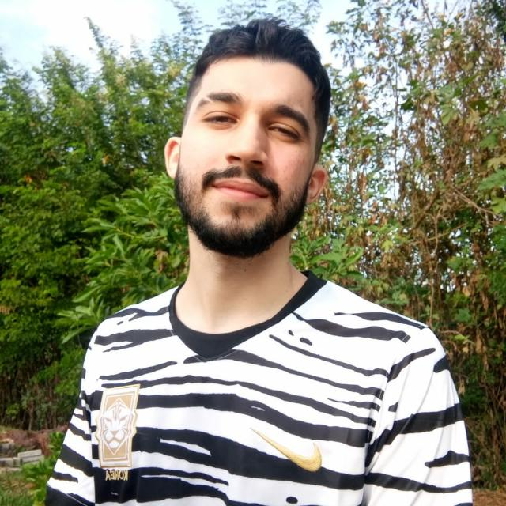

## 1. Sobre o projeto

&emsp;&emsp;Repositório reservado à disciplina de Arquitetura e Desenho de Software da Universidade de Brasília sobre o desenvolvimento do aplicativo Garimpei. Ele retém o armazenamento e a apresentação de artefatos e processos desenvolvidos na disciplina, como pré-rastreamento, heurística, modelagem, análise e pós-rastreamento para melhorar os requisitos não funcionais e funcionais do aplicativo.

## 2. Sobre o Garimpei

&emsp;&emsp;Imagine uma comunidade que resolve abrir um bazar/brechó, com artigos que são doados ou mesmo confeccionados por membros da comunidade. Esses artigos acabam sendo vendidos para os próprios locais. Por que não pensar em um aplicativo ou aplicação web, e ampliar as estratégias de venda dessa iniciativa da comunidade? Estando na internet, pessoas até mesmo de outras localidades poderiam se interessar pelos artigos.

## 3. Equipe

|                                                      | Membro             | Github            |
| :----------------------------------------------------: | :------------------: | :-----------------: |
|  | Matheus Afonso | [matheusafonsouza](https://github.com/matheusafonsouza) |
|  | Paulo Victor | [twistershark](https://github.com/twistershark) |
|  | Vinicius Saturnino | [viniciussaturnino](https://github.com/viniciussaturnino) |
|  | Thiago Mesquita | [thiagompc](https://github.com/thiagompc) |
|  | Juliana Pereira | [julianavalle](https://github.com/julianavalle) |
|  | Daniel Barcelos |  |
|  | Mateus Gomes | [matgomes21](https://github.com/matgomes21) |
|  | Denys Rógeres |  |
|  | Victor Jorge |  |

## 4. Histórico de versão

| Versão | Data       | Descrição                                           | Autor        |
| ------ | ---------- | --------------------------------------------------- | ------------ |
| 0.1    | 28/01/2022 | Criação da página de início | Matheus Afonso |