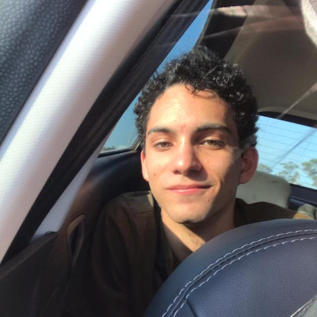
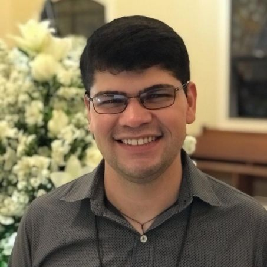
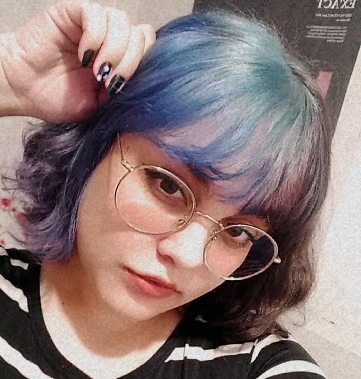
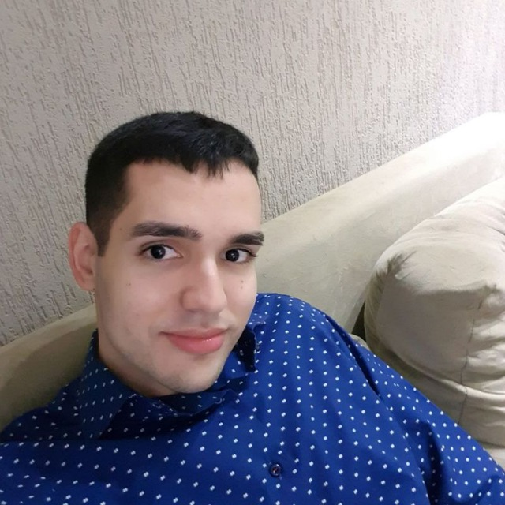
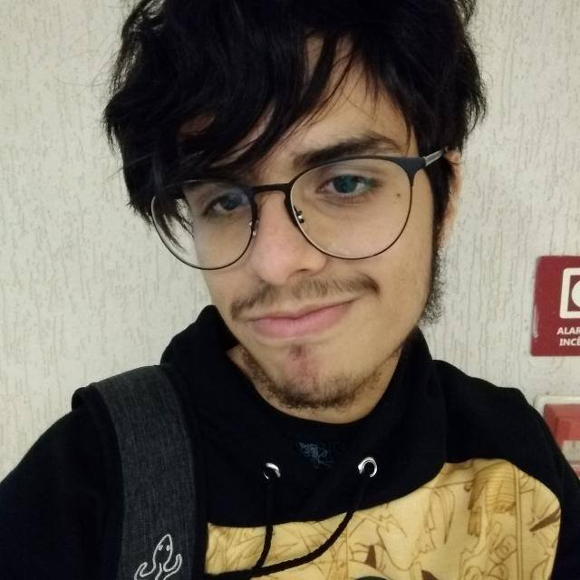
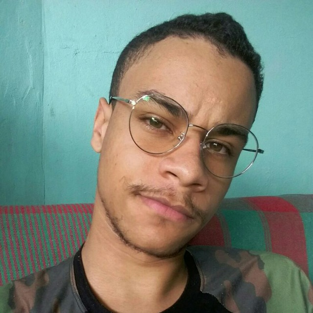
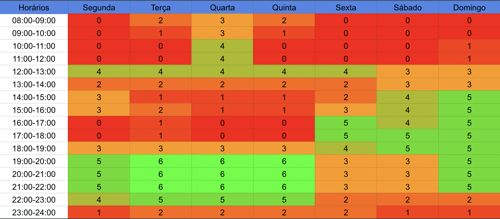

## 1. Histórico de versão

| Versão | Data       | Descrição                                           | Autor        |
| ------ | ---------- | --------------------------------------------------- | ------------ |
| 0.1    | 28/01/2022 | Criação da página de início | Matheus Afonso |
| 0.2    | 02/02/2022 | Adição do heatmap de horários, centralização das tabelas e mudança na ordem | Matheus Afonso |
| 0.3    | 04/02/2022 | Adição do github dos participantes | Mateus Gomes |
| 0.4    | 21/02/2022 | Atualização dos caminhos das imagens | Paulo Victor |

## 2. Sobre o projeto

&emsp;&emsp;Repositório reservado à disciplina de Arquitetura e Desenho de Software da Universidade de Brasília sobre o desenvolvimento do aplicativo Garimpei. Ele retém o armazenamento e a apresentação de artefatos e processos desenvolvidos na disciplina, como pré-rastreamento, heurística, modelagem, análise e pós-rastreamento para melhorar os requisitos não funcionais e funcionais do aplicativo.

## 3. Sobre o Garimpei

&emsp;&emsp;Imagine uma comunidade que resolve abrir um bazar/brechó, com artigos que são doados ou mesmo confeccionados por membros da comunidade. Esses artigos acabam sendo vendidos para os próprios locais. Por que não pensar em um aplicativo ou aplicação web, e ampliar as estratégias de venda dessa iniciativa da comunidade? Estando na internet, pessoas até mesmo de outras localidades poderiam se interessar pelos artigos.

## 4. Equipe

|                                                      | Membro             | Github            |
| :----------------------------------------------------: | :------------------: | :-----------------: |
|  | Matheus Afonso | [matheusafonsouza](https://github.com/matheusafonsouza) |
|  | Paulo Victor | [twistershark](https://github.com/twistershark) |
|  | Vinicius Saturnino | [viniciussaturnino](https://github.com/viniciussaturnino) |
|  | Thiago Mesquita | [thiagompc](https://github.com/thiagompc) |
|  | Juliana Pereira | [julianavalle](https://github.com/julianavalle) |
|  | Daniel Barcelos | [daniel-bm](https://github.com/daniel-bm) |
|  | Mateus Gomes | [matgomes21](https://github.com/matgomes21) |
|  | Denys Rógeres | [DenysRogeres](https://github.com/DenysRogeres) |
|  | Victor Jorge | [VictorJorgeFGA](https://github.com/VictorJorgeFGA) |

## 5. Heatmap da equipe

&emsp;&emsp;No ínicio do planejamento do projeto a equipe se reuniou para levantar um mapa de heatmap e, assim, poder ter registrado de maneira facilitada os horários disponiveis em comum entre os integrantes da equipe. Abaixo há o heatmap de horários gerado depois da reunião da equipe:

<figcaption>Imagem 1: Heatmap de horários da equipe.</figcaption>

